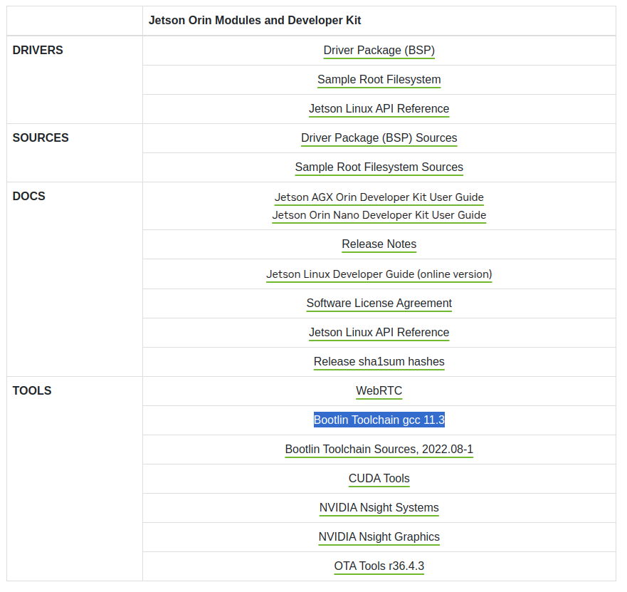

# RISC-V: Baremetal From The Ground Up (Chipyard Edition)

Let's start with something simple. The "hello world" equivalent program in the embedded systems world would be the blinkly LED program.

```c
#define SET_BITS(REG, BIT)              ((REG) |= (BIT))
#define CLEAR_BITS(REG, BIT)            ((REG) &= !(BIT))

#define GPIOA_BASE                      0x10010100UL

volatile unsigned int counter;

void simple_delay() {
  for (int i=0; i<1000; i+=1) {
    asm volatile("nop");
  }
}

int main() {
  *(unsigned int volatile *)(GPIOA_BASE + 0x00) = 0x01;

  while (1) {
    SET_BITS(*(unsigned int volatile *)(GPIOA_BASE + 0x00), 0x01);
    simple_delay();
    
    CLEAR_BITS(*(unsigned int volatile *)(GPIOA_BASE + 0x00), 0x01);
    simple_delay();
    
    counter += 1;
  }
  return 0;
}

```

Embedded programs, most of the time, are all about MMIO register manipulations.

Now, in order to compile this C program to something our SoC can understand, we need to use the RISC-V Toolchain.


## RISC-V Toolchain

The RISC-V Toolchain is a collection of executables that helps us to compile, assemble, and link the program we write in C/C++ to binary format. It can also provide tools for us to debug and analyze the generated binaries.

There is a wide range of choices of toolchains, usually marked by different prefixes. The following is a simple list of the common ones that we may encounter:

* TODO

Here, we will use the [riscv-gnu-toolchain](https://github.com/riscv-collab/riscv-gnu-toolchain) from [riscv-collab](https://github.com/riscv-collab) (it comes with the prefix `riscv64-unknown-elf-`).

For toolchain installation, see \[TODO link]


After installation, we can see that we have a set of executables in the installation directory.

`-gcc` is the most general one. You can consider it as the entry executable which can invoke the compiler, the linker, and the assembler by passing it different compiler flags.

`-ar` is the assembler itself.

`-ld` is the linker itself.

`-objdump`, `-readelf`, and `-nm` are elf file analyzers.

`-objcopy` is the format converter. It can convert between elf format, binary, hex, and many other.

All of these toolchain executables will run on the host machine, but it knows the architecture of the target SoC, and thus can build the binary in the format that our target can understand.


## Build Process

### Pre-processing Stage

<figure><figcaption></figcaption></figure>

The first stage is the pre-processing stage. In this stage, the compiler will resolve all the [compiler macros](https://gcc.gnu.org/onlinedocs/cpp/Macros.html) (basically, everything we defined with "#" marks).&#x20;


By default, the compiler will not generate this intermediate "main.i" file for us. To do this, we will pass the `-E` argument to tell the compiler stop after pre-processing. We use the `-o` argument to specify the output file.

> Note: because the toolchain can be installed on different paths on different machines, we will represent the path to the toolchain with `$RISCV` environment variable.

```bash
$RISCV/riscv64-unknown-elf-gcc -E -o main.i main.c
```


We can see that in `main.i`, all of the macro defines are processed and replaced with their actual contents.

```c
# 0 "main.c"
# 0 "<built-in>"
# 0 "<command-line>"
# 1 "main.c"


volatile unsigned int counter;

void simple_delay() {
  for (int i=0; i<1000; i+=1) {
    asm volatile("nop");
  }
}

int main() {
  *(unsigned int volatile *)(0x10010100UL + 0x00) = 0x01;

  while (1) {
    ((*(unsigned int volatile *)(0x10010100UL + 0x00)) |= (0x01));
    simple_delay();

    ((*(unsigned int volatile *)(0x10010100UL + 0x00)) &= !(0x01));
    simple_delay();

    counter += 1;
  }
  return 0;
}

```


