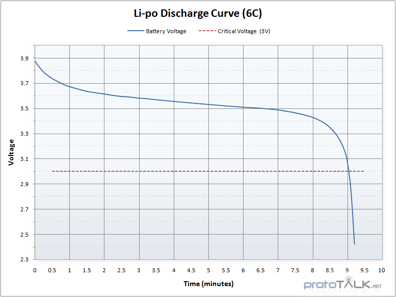
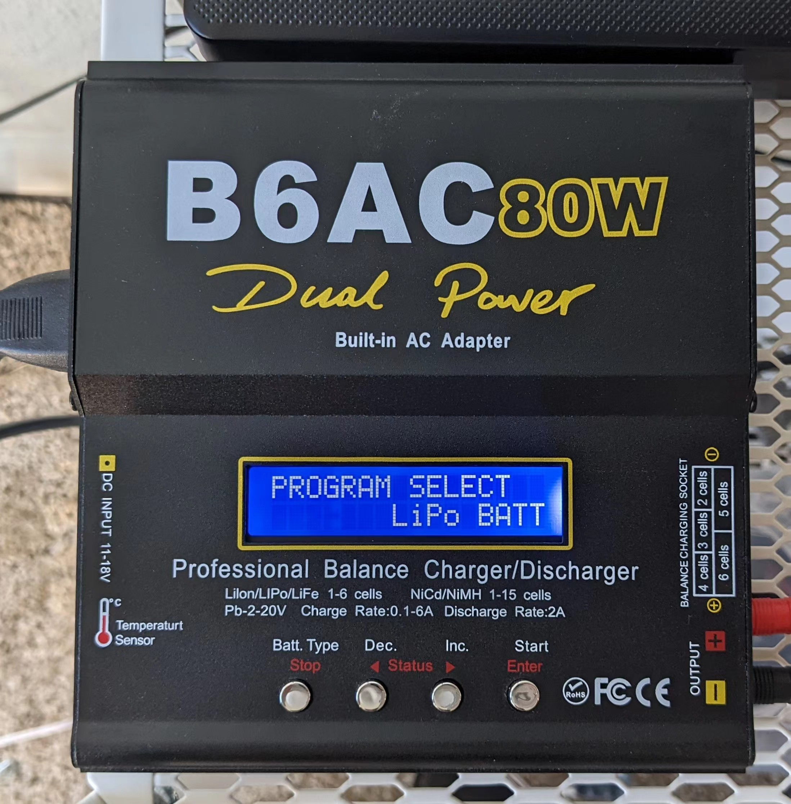
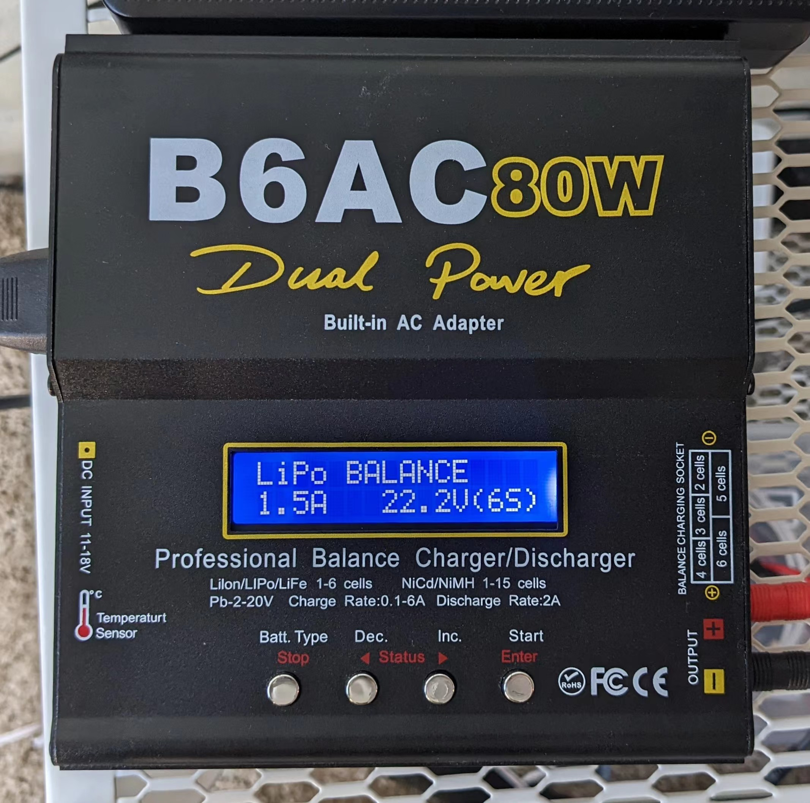
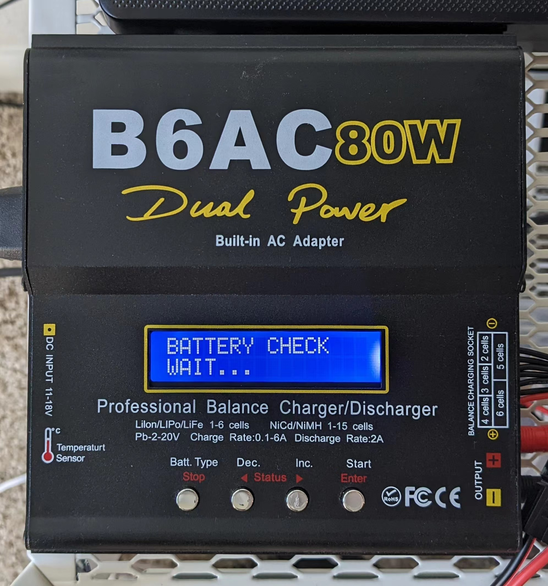
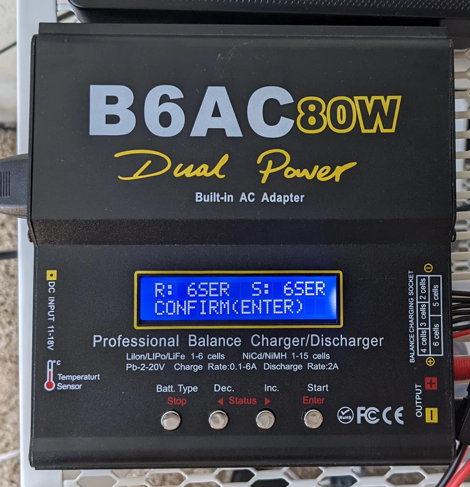
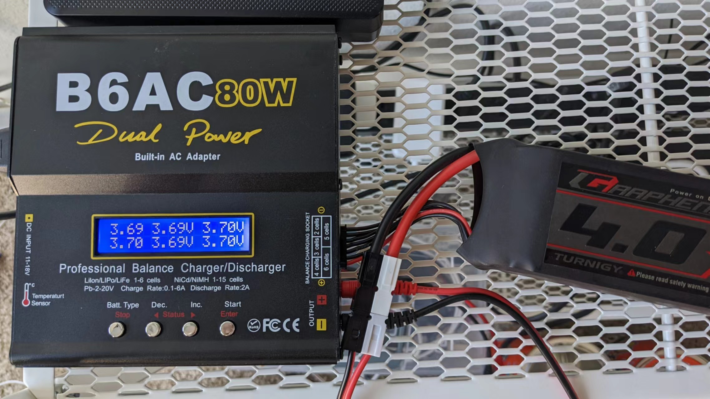

# LiPo Safety

## Quick Reference

### LiPo Voltage

|                 |                                          |
| --------------- | ---------------------------------------- |
| Fully Charge    | <mark style="color:green;">4.2 V</mark>  |
| Storage Voltage | <mark style="color:blue;">3.8 V</mark>   |
| Nominal         | 3.7 V                                    |
| Low             | <mark style="color:orange;">3.5 V</mark> |
| Critical        | <mark style="color:red;">3.0 V</mark>    |

<figure><figcaption></figcaption></figure>

### LiPo Maximum Charging Current

$$
I = capacity / h
$$

e.g. for a 2200 mAh battery, maximum charging current should be `2200mAh / h = 2.2 A`

## General Safety

### Charging

* NEVER LEAVE A CHARGING BATTERY UNATTENDED.
* Double-check the parameters on the charger. Make sure **cell type**, **cell count**, and **maximum charge current** match the label on the battery.
* Never charge a battery that is still warm after usage, and never use a battery that is still warm from charging.
* Never charge your LiPo batteries inside a Vehicle.

### In Use

* Never expose LiPo batteries to extreme temperatures or in direct sunlight for prolonged periods. The suitable temperature range is between **4 °C \~ 49 °C** (40 \~ 120°F).
* Never discharge your LiPos below **3 V** under load.
* Take LiPos out from the model when you’re done.
* Put LiPos on a clear surface when not in use for a short amount of time. **DO NOT** put them into your pockets even for short periods.
* Keep battery connectors/terminals away from metal objects.
* If the LiPo battery is swelling (puffing), stop immediately and dispose of it.

### Storage

* Always store your LiPos at room temperature of between **4 °C \~ 21 °C** (40 \~ 70 °F).
* If you will not be using your LiPos for more than three days, charge/discharge them to storage voltage.
* Never store your LiPos fully charged.
* Make sure each cell is as balanced as possible.
* Check the Internal Resistance (IR) and Voltage (V) for LiPos that have been stored away for more than **6 months**. For safe LiPos, the voltage of each cell should never reach below 3V and the IR should not exceed the original value by over 80-90%.
* Batteries that have lost 20% of their initial capacity should be removed from service and disposed of properly.

### Disposal

If the LiPo battery is swollen, ballooned, or damaged, or has been overcharged or over-discharged (voltage have been fallen under 3V), or has lost 20% of its initial capacity:

* Fully discharge the battery with a resistive load.&#x20;
* Keep close monitor of the battery's temperature.
* Bring the battery to a proper recycle center.

## Using the B6AC Style Charger

1\. Click "Batt. Type / Stop" button,  select the correct battery chemistry type. Click "Dec. / <" button to change type. Click "Start / Enter" to confirm selection.

<figure><figcaption></figcaption></figure>

2\. Click "Dec. / <" or "Inc. / >" to change charging type to **LiPo BALANCE**. Click "Start / Enter" to configure maximum charging current and cell count. Click "Dec. / <" or "Inc. / >" to change value.&#x20;

<figure><figcaption></figcaption></figure>

3\. Plug in the battery main terminal and balance port. Long-press the "Start / Enter" button to start battery check.

<figure><figcaption></figcaption></figure>

4\. Click the "Start / Enter" button to start charging.

<figure><figcaption></figcaption></figure>

5\. During charging, clicking  "Dec. / <" or "Inc. / >" can view different battery info.

<figure><figcaption></figcaption></figure>

