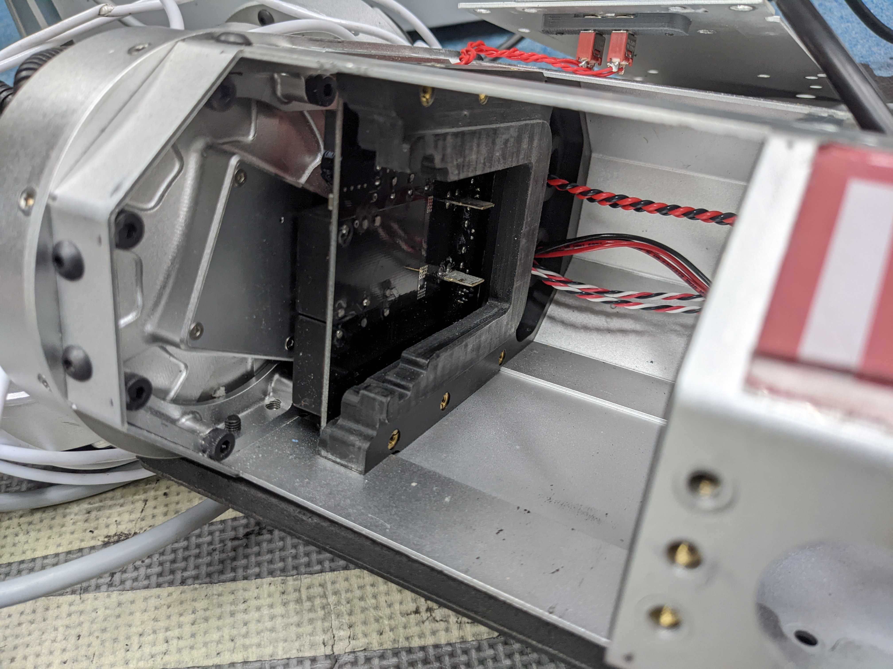
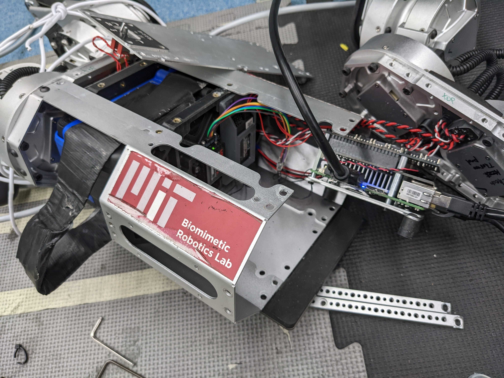
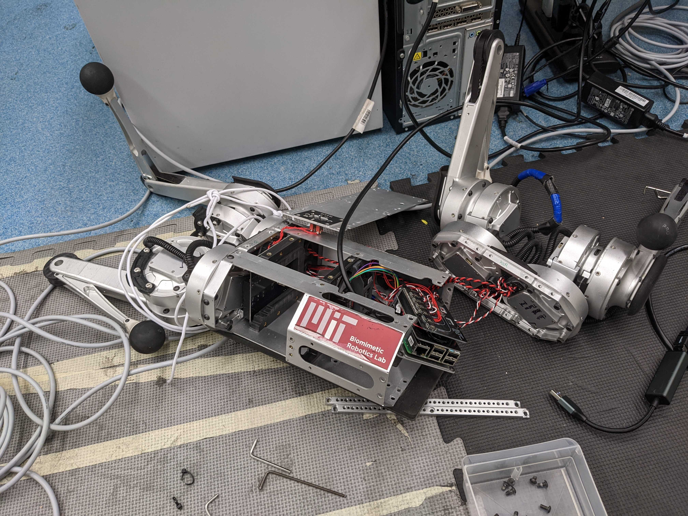
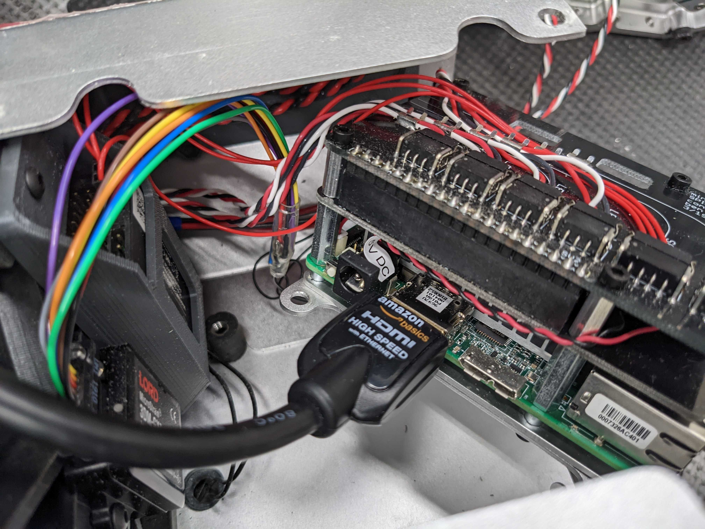
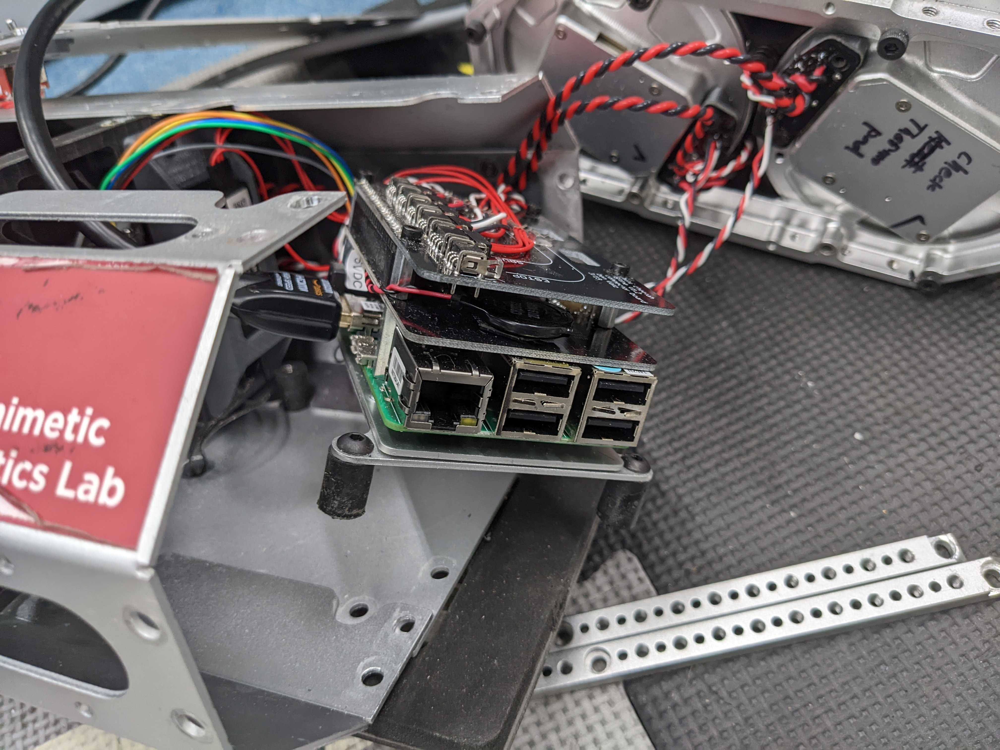

# Fixing MIT Mini Cheetah

A USB port issue.

Different from the Unitree dogs, the Mini Cheetah uses a single piece of aluminum casing for the body. So we need to remove one end completely to access the internals.

<figure><figcaption></figcaption></figure>

After removing the screws surrounding the end cap, we can pull the motors out and access the computer inside.

<figure><figcaption></figcaption></figure>

<figure><figcaption></figcaption></figure>

The issue is that the USB expansion board mounted on the body is not working. So we ended up getting a new expansion hub and just glued it to the frame. It's tricky to get one with similar dimension.

<figure><figcaption></figcaption></figure>

<figure><figcaption></figcaption></figure>

