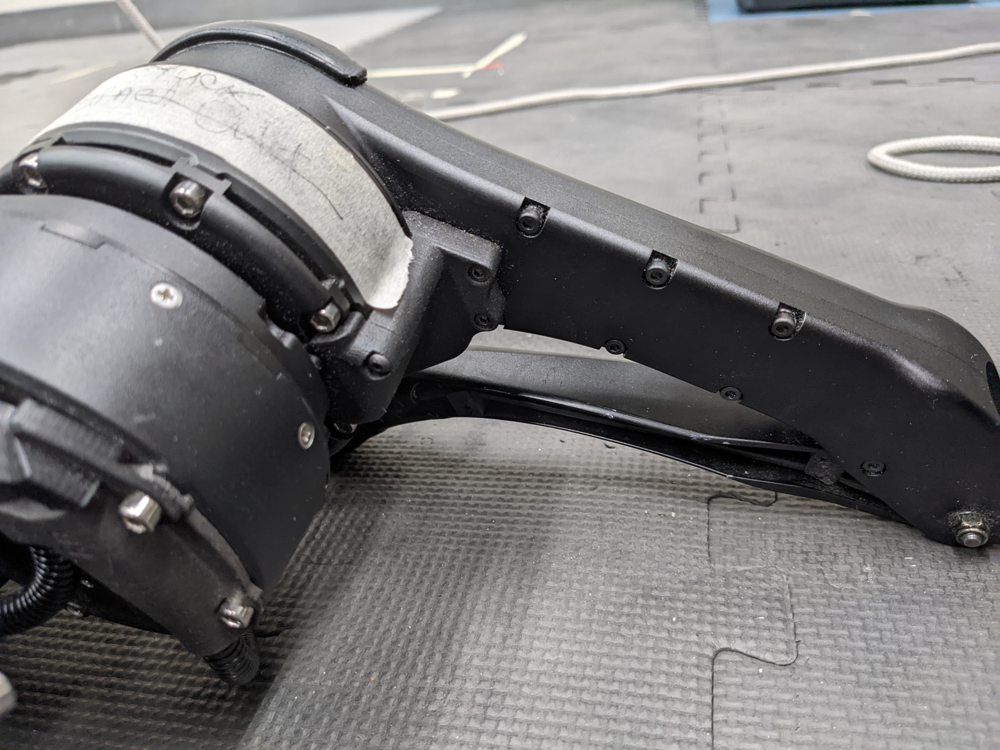
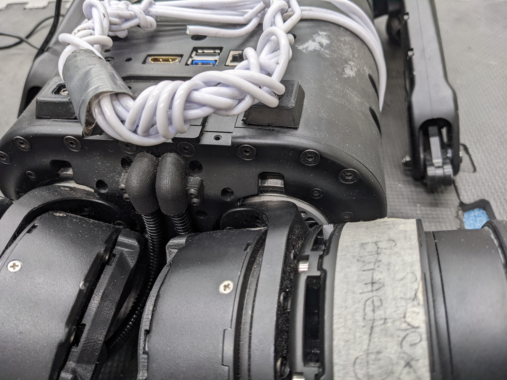
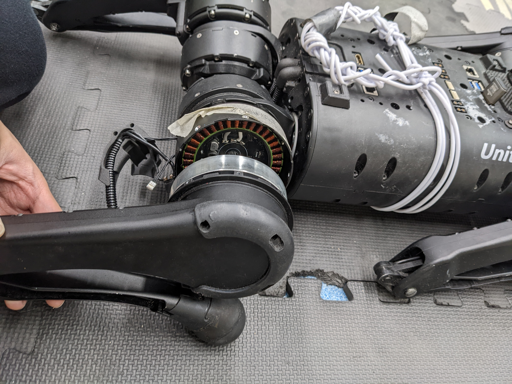
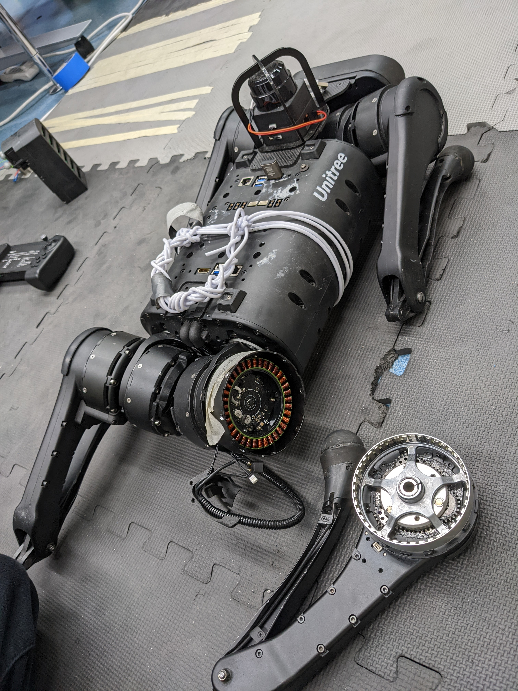
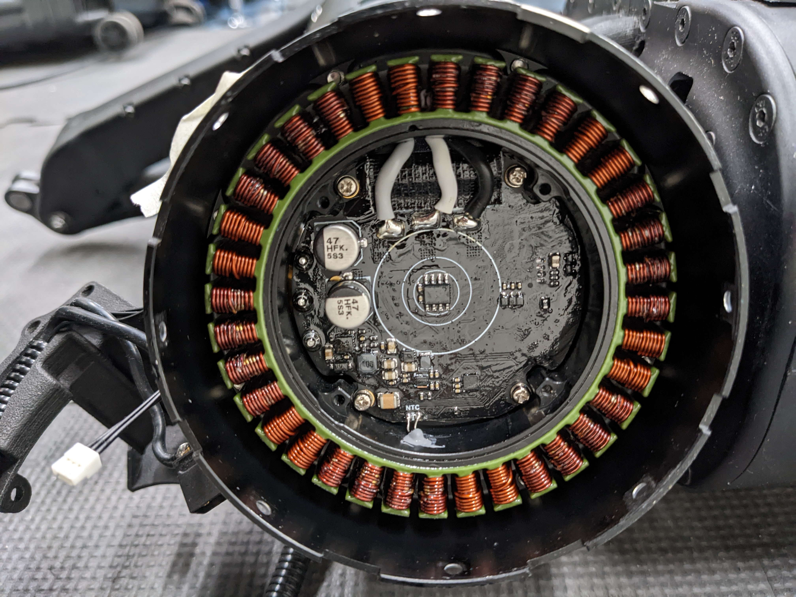
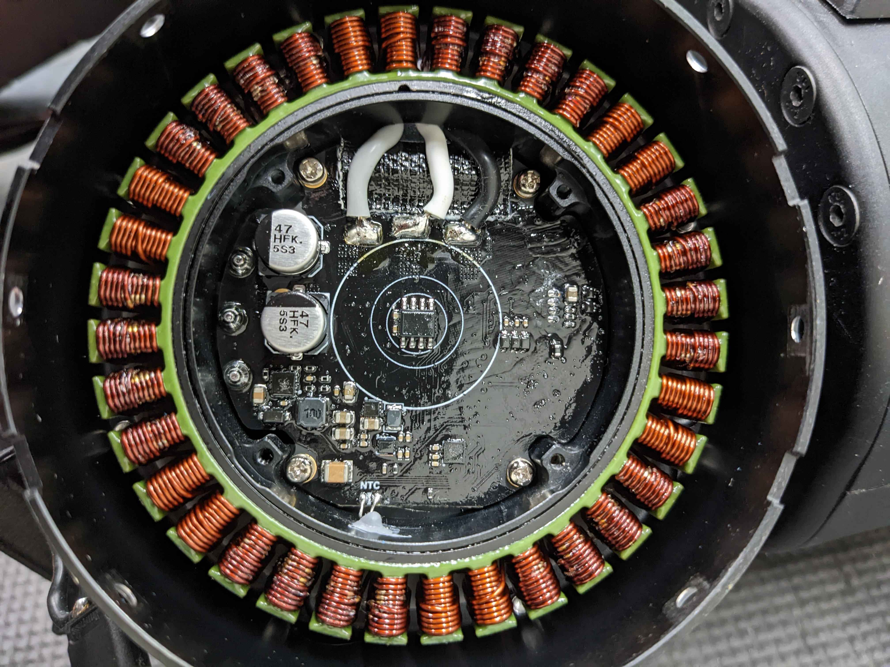
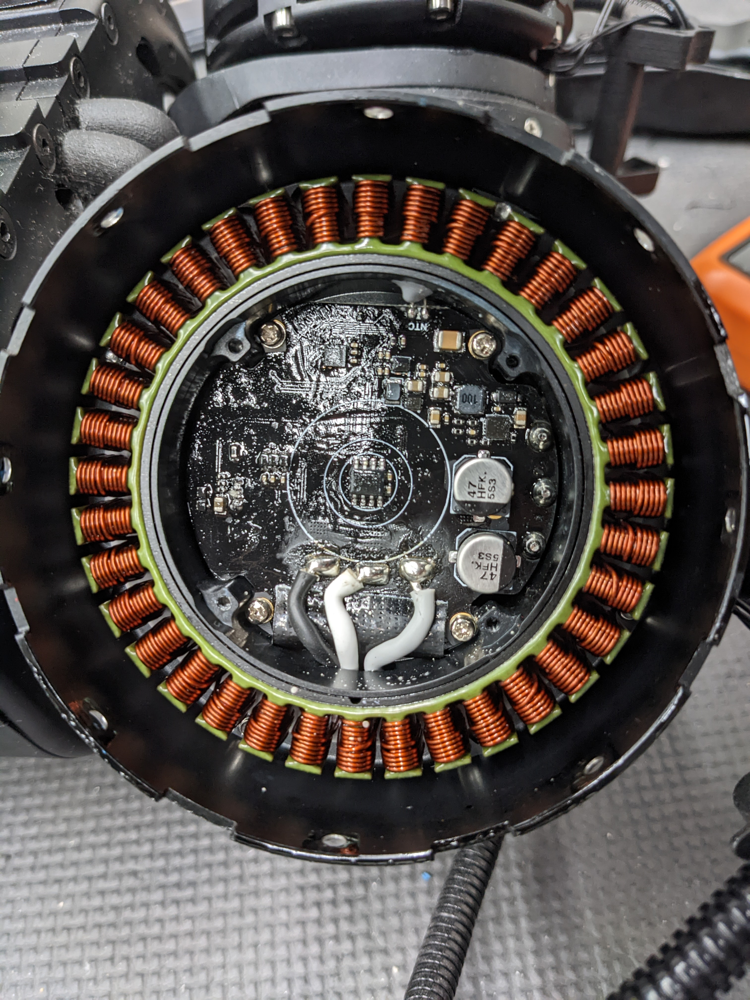
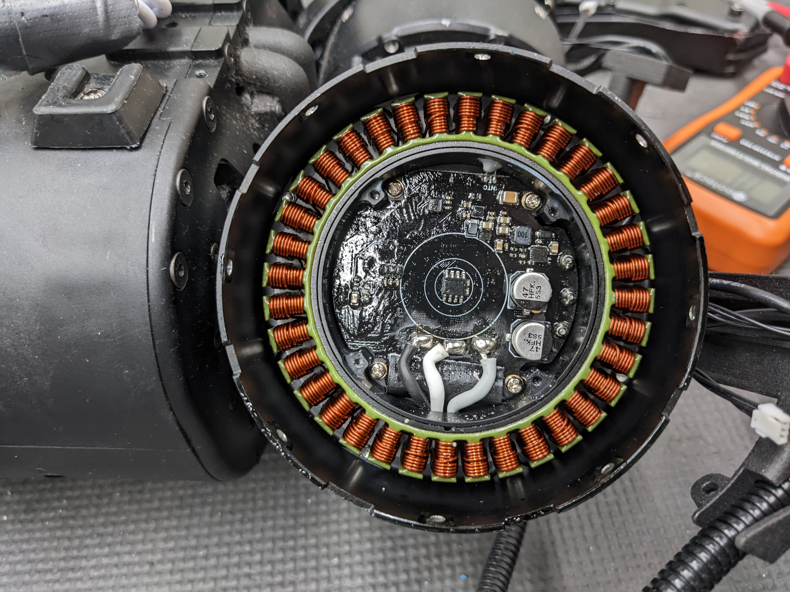
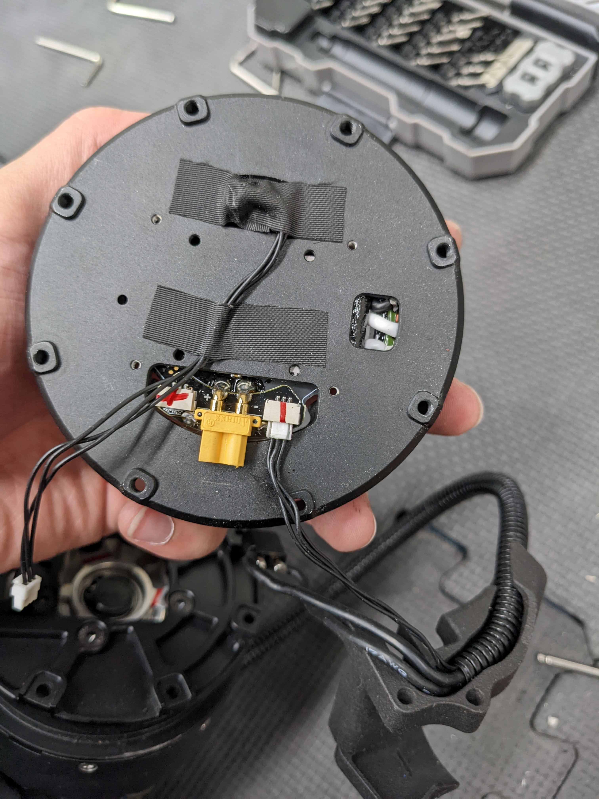

# Fixing the Unitree A1 Robot Dog Leg Motor

For some reason the rear right calf motor is dead...

<figure><figcaption></figcaption></figure>

Initially I was looking these screws to figure out how to disassemble the leg structure

<figure><figcaption></figcaption></figure>

Turns out we don't need to touch those. Instead, the leg is mounted with the screws around the motors.

The leg is tricky to work with, since the calf joint and the hip pitch joint is very close together, and there's not much room to insert the tools.

<figure><figcaption></figcaption></figure>

I've later talked with the USC ppl, and they suggested that we can take a L-shaped hex wrench and cut off the extra length. A normal metal saw should do the job.&#x20;

Haven't attempted this yet.

Since initially we could not remove those screws, I decided to remove the screws holding the actuator together, to see if we can diagnose anything.

<figure><figcaption></figcaption></figure>

<figure><figcaption></figcaption></figure>

Driver board seems fine...

<figure><figcaption></figcaption></figure>

 

<figure><figcaption></figcaption></figure>

 

<figure><figcaption></figcaption></figure>

 

<figure><figcaption></figcaption></figure>

Later with a newer hex wrench we were able to remove the motor.

<figure><figcaption></figcaption></figure>

Always remember to take a photo before removing these signal cables, to remember which cable plugs where.

<figure><figcaption></figcaption></figure>

## Update

<figure><figcaption></figcaption></figure>

We got the spare leg from USC. Now the dog is working.

Thx USC.

<figure><figcaption></figcaption></figure>

