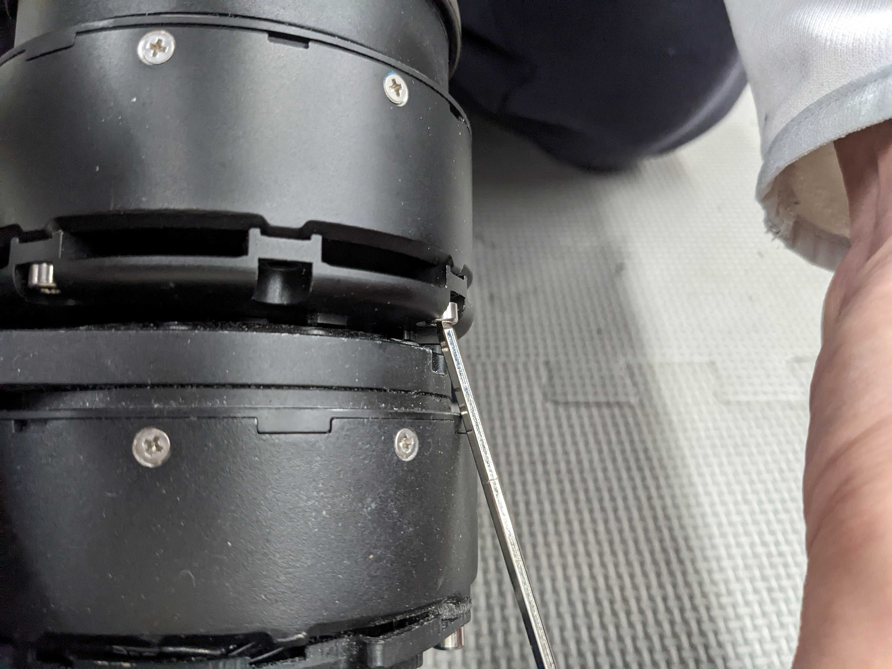
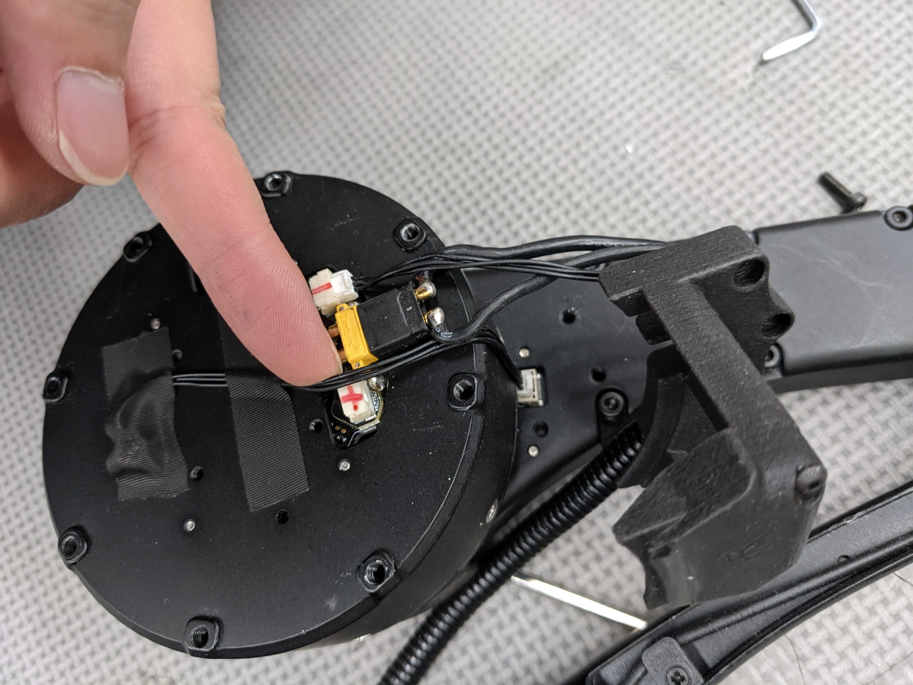
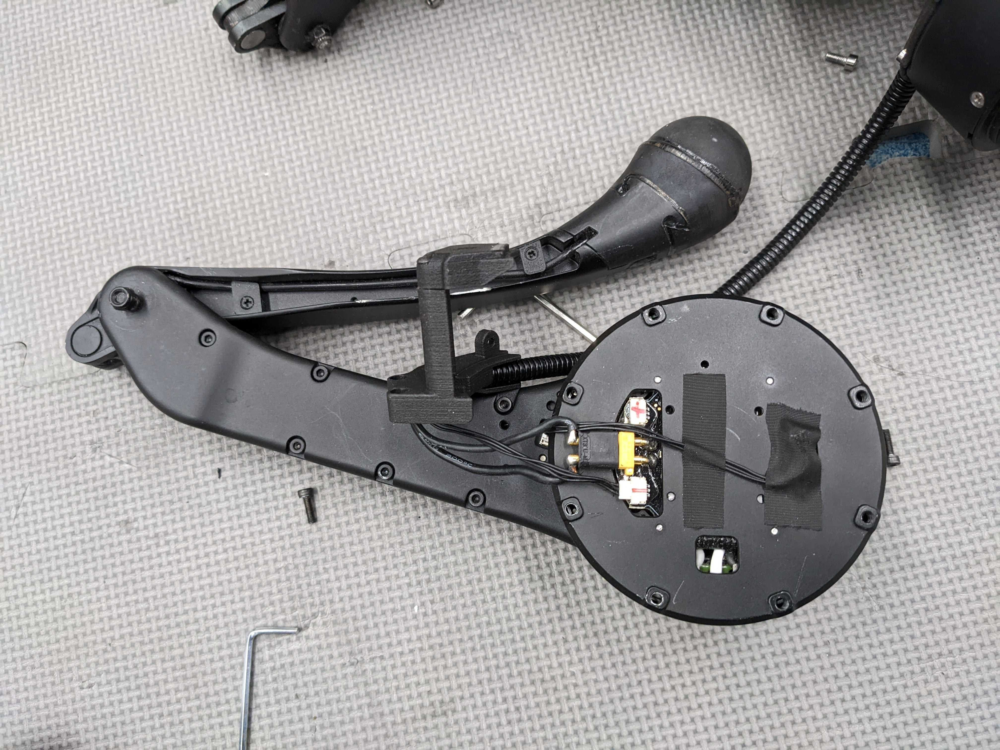
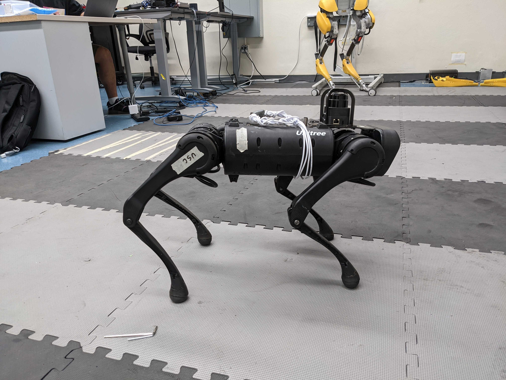

# Fixing the Unitree A1 Robot Dog Leg Motor

The leg is tricky to work with, since the calf joint and the hip pitch joint is very close together, and there's not much room to insert the tools.

<figure><figcaption></figcaption></figure>

I've later talked with the USC ppl, and they suggested that we can take a L-shaped hex wrench and cut off the extra length. A normal metal saw should do the job.&#x20;

Haven't attempted this yet.

Always remember to take a photo before removing these signal cables, to remember which cable plugs where.

<figure><figcaption></figcaption></figure>

## Update

<figure><figcaption></figcaption></figure>

We got the spare leg from USC. Now the dog is working.

Thx USC.

<figure><figcaption></figcaption></figure>

