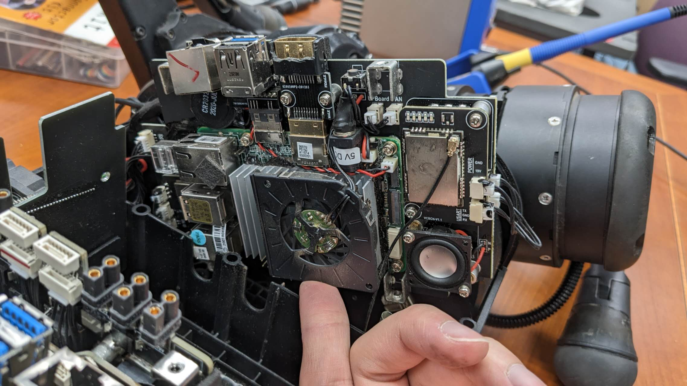

# Fixing the Unitree A1 Robot Dog Ethernet Port

So the two Ethernet ports on our A1 robot are broken when running some unstable RL algorithm experiments. And I was asked to fix them.

<figure><figcaption>
The dog. Note that the Ethernet ports are crippled
</figcaption></figure>

## Disassembly

A1 is a bit more complicated compared to MIT Mini Cheetah. In order to take the top shell off, we need to remove:

* Screws on the top of the body
* Screws on the bottom side of the body
* Top half of the screws mounting the motor

I accidentally removed all of the screws mounting the rear motors, so the rear legs fall off.

<figure><figcaption></figcaption></figure>

The signal cables are not very long, and thus I ripped off the connector. Fortunately, the signal pads and connector itself are not damaged, so I was able to solder it back.

<figure><figcaption></figcaption></figure>

## Components

<figure><figcaption>
top shell taken off
</figcaption></figure>

<figure><figcaption>
High level controller board
</figcaption></figure>

<figure><figcaption>
Power distribution board
</figcaption></figure>

<figure><figcaption>
Not sure what this board is for
</figcaption></figure>

<figure><figcaption>
Low level controller board
</figcaption></figure>

To desolder and resolder the Ethernet port, we need to take the board out. In order to know which wire connects to where, I marked each connector with a unique marking with a Sharpie.

<figure><figcaption></figcaption></figure>

It's interesting to see that they conformal coated the entire board to make it waterproof.

<figure><figcaption>
High level controller board taken out
</figcaption></figure>

<figure><figcaption>
High level controller board, back side
</figcaption></figure>

When taking out the low level controller board, pay special attention to the WiFi MHF4 connector. It is very fragile and easy to tear the pad off.

<figure><figcaption>
MHF4 connector
</figcaption></figure>

<figure><figcaption>
Similar marking on the low level controller board
</figcaption></figure>

<figure><figcaption>
Low level controller board taken out
</figcaption></figure>

<figure><figcaption>
Low level controller board, back side
</figcaption></figure>

## The Ethernet Jack

Unfortunately, our lab bought the wrong replacement Ethernet jack.

<figure><figcaption></figcaption></figure>

Found a similar enough Ethernet jack:



We still need to make a small modification to this part. Because the housing pin is wider and smaller on the A1 board footprint, we need to straighten the housing pin on the connector, and fold it.

<figure><figcaption>
left side: before modification; right side: after modification
</figcaption></figure>

<figure><figcaption>
After modification it fits the footprint
</figcaption></figure>

<figure><figcaption>
Soldered and assebled
</figcaption></figure>

## It worked

(at least I did not damage the rest of the components...)

<figure><figcaption></figcaption></figure>
