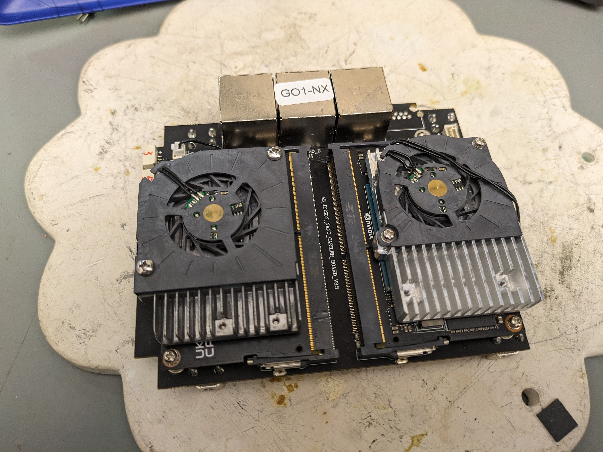
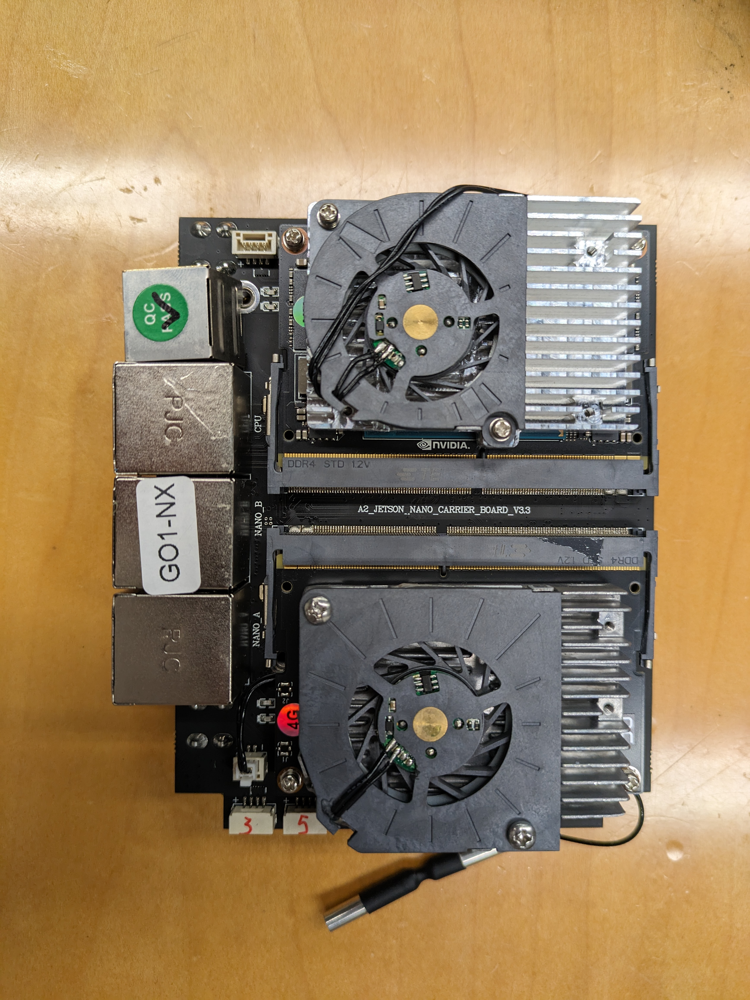

# Fixing the Unitree Go1 Robot Dog Ethernet Port

Another Ethernet port accident.

Similar to the previous post.

&#x20;

It's interesting to see two Jetson Nanos sitting side by side on a board. It must be tricky to route the traces on the base board...

<figure><figcaption></figcaption></figure>

<figure><figcaption></figcaption></figure>

<figure><figcaption></figcaption></figure>

To prevent future accidents, we ended up printing a small protective case, the case is mounted on the body using that four M2 screw holes.

<figure><figcaption></figcaption></figure>

