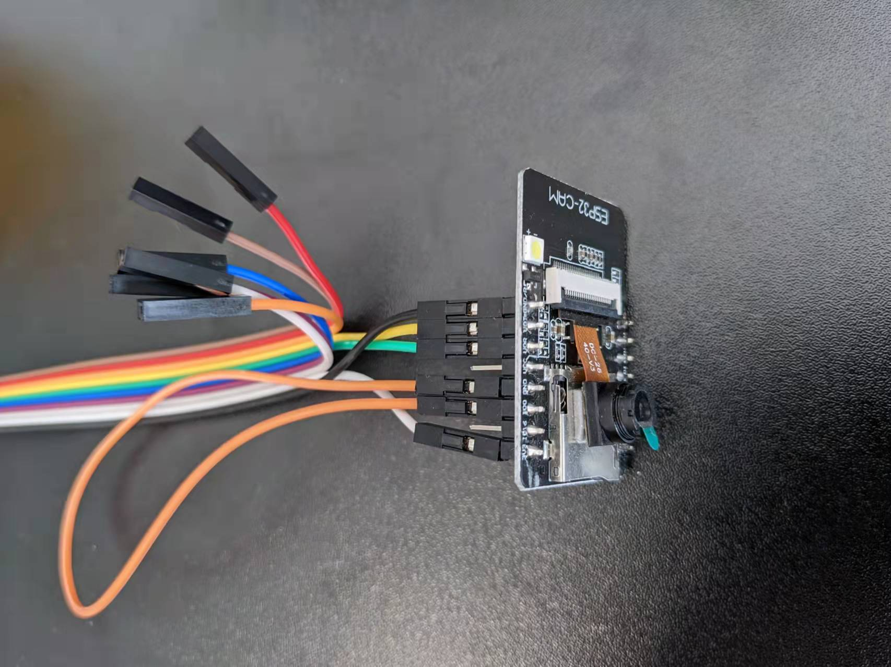

# Remote Controlled Humanoid Robot Whitepaper And Design Notes

## 人设图


## Mechanical Details

Bone Dimension

.png>)

Number of joints: 39

&#x20; head (neck): 3

&#x20; arm: (3+2+3) x 2

&#x20; body: 6

&#x20; leg: (3+2+2) x 2

<figure><figcaption></figcaption></figure>

<figure><figcaption></figcaption></figure>

## Electrical Details


## Control System Details

### Input methods

* [x] XboxController (Python `dotxboxcontroller` [library](https://pypi.org/project/dotxboxcontroller/))
* [ ] IMU angle motion capture (MPU6050 / BNO085) + UWB positioning ++
* [ ] Vive VR
* [ ] Small scale model ++
* [ ] Camera Mocap

### Sync methods

* [ ] Blender
* [ ] Unreal

### Output methods

* [ ] Blender
* [ ] Unreal (digital twin to robot)
* [ ] Pi @ Robot, display control status (Operation GUI)
* [ ] Actual Robot


Joint Position Packet Format

```
joints = [arms[], legs[], hands[], head, neck, spines[], waist, hip]

joints[0:6]: left arm
joints[6:12]: right arm
joints[12:18]: left leg
joints[18:24]: right leg
joints[24:29]: left hand (5 fingers)
joints[29:34]: right hand (5 fingers)
joints[34]: head
joints[35]: neck
joints[36]: spine_0
joints[37]: spine_1
joints[38]: waist
joints[39]: hip
```


### Vision feedback


