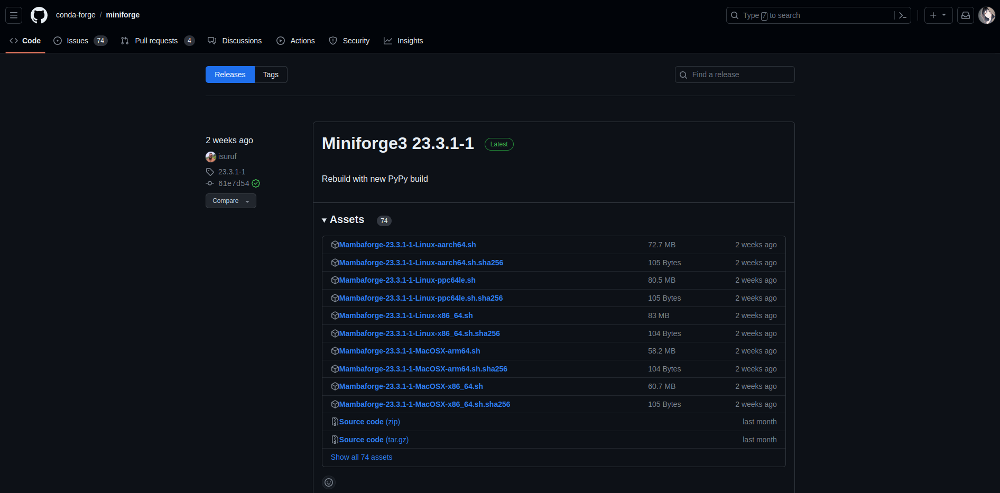

# Quick Start With Chipyard on Ubuntu or WSL


**Note:**

The following tutorial content is tested on Ubuntu 20.04, Ubuntu 22.04, and WSL 2.0 on Windows 10 systems with Chipyard release 1.10.1



## Installation

### Step 1. Install conda

Chipyard uses [Conda](https://docs.conda.io/en/latest/) to manage the development environment and packages.

Download Conda from the miniforge [release page](https://github.com/conda-forge/miniforge/releases).


Select the corresponding version and download the file ending with ".sh".

<figure><figcaption></figcaption></figure>

After download, we need to mark the script as executable.&#x20;

```bash
chmod +x ~/Downloads/Mambaforge-23.3.1-1-Linux-x86_64.sh
```

Then, execute the script.

```bash
~/Downloads/Mambaforge-23.3.1-1-Linux-x86_64.sh
```

Follow the installation prompt. The program will prompt you to input the installation location. Here, we are using `/home/tk/Documents/mambaforge`.

After installation, it will ask whether to execute `conda init`. Enter "yes" to the prompt.

<figure><figcaption></figcaption></figure>

Conda is now installed on the system.


**Note**:&#x20;

After installing conda, the `conda` path is not added to the PATH environment variable of the current terminal.&#x20;

If the `conda: command not found` error occured, open a new terminal (or source `~./bashrc`).



### Step 2. Install conda-lock

Chipyard also requires the `conda-lock` module. Install `conda-lock` by executing the following commands.

```bash
conda install -n base conda-lock==1.4.0
conda activate base
```


### Step 3. Clone Chipyard

Open terminal in a known location. Here, we will use the directory `/home/tk/Desktop/`. In the terminal, execute the following command.

```bash
git clone git@github.com:ucb-bar/chipyard.git
```


### Step 4. Configure Chipyard

By default, chipyard setup script initializes/installs things in the following order:

1. Conda environment
2. Chipyard submodules
3. Toolchain collateral (Spike, PK, tests, libgloss)
4. Ctags
5. Chipyard pre-compile sources
6. FireSim
7. FireSim pre-compile sources
8. FireMarshal
9. FireMarshal pre-compile default buildroot Linux sources
10. Runs repository clean-up

To execute the setup script, run the following command.

```bash
./build-setup.sh riscv-tools -s 6 -s 7 -s 8 -s 9 --force
```

The `--force` flag is used to skip the confirmation prompt, which is buggy on some terminals.


The set up process will take around 10-30 minutes, depending on the system configuration. After the script is finished, Chipyard is initialized and is ready to be used.


## Running RTL Simulation

### Step 1. Preparing the Environment <a href="#id-1.-prepare-environment" id="id-1.-prepare-environment"></a>



On Ubuntu, we will use the open-source Verilator to simulate.

We don't need to do anything special to use Verilator. Just remember to source the env.sh script.

```bash
source $chipyard/env.sh
```



Use the following script to source vcs and other related tools.

```bash
source /ecad/tools/vlsi.bashrc
```



On BWRC machine, we need to source the VCS simulator path. This can be done by executing the following commands.

```bash
export VCS_HOME=/tools/synopsys/vcs/S-2021.09-SP1-1/
export VERDI_HOME=/tools/synopsys/verdi/S-2021.09-SP1-1/
export VCS_64=1
export PATH=$VCS_HOME/bin:$VERDI_HOME/bin:$PATH
```

Alternatively, run the following all-in-one script

```bash
source /tools/C/chiyufeng/documents/vcs_env.sh
```


If running into license issues, try running the following command

```bash
source /tools/flexlm/flexlm.sh
```


If running into JDK\_HOME issue(JDK/lib/tools.jar not found), try the following command

```bash
export JDK_HOME=/usr/lib/jvm/java-1.8.0/
```




### Step 2. Build the RISC-V binaries <a href="#id-2.-run-simulation" id="id-2.-run-simulation"></a>

To build simulation code:

```bash
# inside chipyard directory
cd ./tests/
make
```


### Step 3. Running the Simulation

Then, we go to the corresponding simulator folder and run the simulation.



```bash
cd $chipyard/sims/verilator/
```


Running a simple RocketConfig simulation

```bash
make run-binary CONFIG=RocketConfig BINARY=../../tests/hello.riscv
```

Running a simulation and generating waveform


```bash
bsub -q ee194 -Is -XF make run-binary-debug CONFIG=RocketConfig BINARY=../../tests/hello.riscv timeout_cycles=10000
```


`timeout_cycles` can be set to a small value to make the waveform dump process faster.


With fast memory loading

```bash
make run-binary CONFIG=RocketConfig BINARY=../../tests/hello.riscv LOADMEM=1
```





```bash
cd $chipyard/sims/vcs/
```


Running a simple RocketConfig simulation

```bash
make run-binary CONFIG=RocketConfig BINARY=../../tests/hello.riscv
```

Running a simulation and generating waveform


```bash
bsub -q ee194 -Is -XF make run-binary-debug CONFIG=RocketConfig BINARY=../../tests/hello.riscv timeout_cycles=10000
```


&#x20;`timeout_cycles` can be set to a small value to make the waveform dump process faster.



```bash
cd $chipyard/sims/vcs/
```


Dispatch the job on ee194 queue


```bash
bsub -q ee194 -Is -XF make run-binary CONFIG=RocketConfig BINARY=../../tests/hello.riscv
```



Dispatch the job on ix queue


```bash
bsub -q ??? -Is -XF make run-binary CONFIG=RocketConfig BINARY=../../tests/hello.riscv
```





### Step 3. Examine Waveform <a href="#id-3.-examine-waveform" id="id-3.-examine-waveform"></a>

Launch verdi to examine the waveform.

```bash
verdi -ssf <fsdb file>
```



```bash
verdi -ssf ./sims/vcs/output/chipyard.harness.TestHarness.REFV256D128ShuttleConfig/tests.fsdb 
```



Quick Reference:

`Ctrl` + `W`: add to current waveform


## Prototype the design on FPGA

### Step 1. Source the tool scripts

Use the following command to add vivado to PATH



```bash
source ~/Documents/Xilinx/Vivado/2024.1/settings64.sh
```



```bash
source /ecad/tools/xilinx/Vivado/2023.2/settings64.sh
```



```bash
source /tools/xilinx/Vivado/2022.2/settings64.sh
```




### Step 2. Building Bitstream

```bash
# in chipyard folder
cd ./fpga/
```


```bash
make SUB_PROJECT=arty100t bitstream
```


## Debugging

### Debug the design with JTAG


