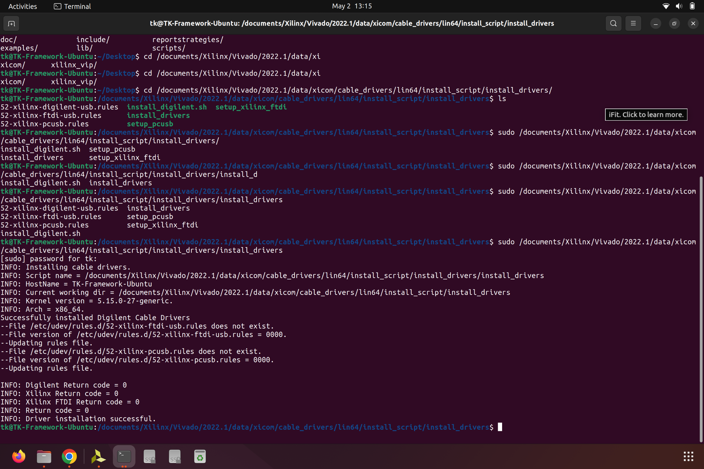

# Installing Xilinx Vivado on Ubuntu 22.04 / 24.04

#### Updates <a href="#updates" id="updates"></a>

2024-07-10 update to Vivado 2024.1

2023-12-20 update to Vivado 2023.2

2024-08-20 update instruction for Ubuntu 24.04


### 1. Download and Install Vivado <a href="#id-1.-download-and-install-vivado" id="id-1.-download-and-install-vivado"></a>

Download Vivado installer from [download page](https://www.xilinx.com/member/forms/download/xef.html?filename=FPGAs\_AdaptiveSoCs\_Unified\_2024.1\_0522\_2023\_Lin64.bin).

After download, run the following command to grant executable right to the binary file.

```bash
chmod +x ~/Downloads/FPGAs_AdaptiveSoCs_Unified_2024.1_0522_2023_Lin64.bin
```

Then, run the file using

```bash
sudo ~/Downloads/FPGAs_AdaptiveSoCs_Unified_2024.1_0522_2023_Lin64.bin
```


<figure><figcaption></figcaption></figure>


In the pop-up window, log in with AMD account.

<figure><figcaption></figcaption></figure>


Select "Vivado".

<figure><figcaption></figcaption></figure>


Select "Vivado ML Standard"

<figure><figcaption></figcaption></figure>

Select the desired installation contents. Here is a brief mapping for the common FPGAs:

<table><thead><tr><th width="229">FPGA Board</th><th>Entry</th></tr></thead><tbody><tr><td>Arty 35T / Arty 100T</td><td>Production Devices -> 7 Series -> Artix-7</td></tr><tr><td>vcu118</td><td>Production Devices -> UltraScale+ -> Virtex UltraScale+</td></tr><tr><td></td><td></td></tr></tbody></table>


<figure><figcaption></figcaption></figure>


Accept the License Agreements.

<figure><figcaption></figcaption></figure>

Select the installation path. Here, we will be using `/home/tk/Documents/Xilinx/`.

<figure><figcaption></figcaption></figure>


Summary Page

<figure><figcaption></figcaption></figure>


### 2. Install Additional Dependencies <a href="#id-2.-install-additional-dependencies" id="id-2.-install-additional-dependencies"></a>

Install Vivado runtime dependencies:



libtinfo5 is no longer supported on Ubuntu 24.04 by default, so we need to download the version from older release.

<pre class="language-bash" data-overflow="wrap"><code class="lang-bash"><strong>wget http://mirrors.kernel.org/ubuntu/pool/universe/n/ncurses/libtinfo5_6.4-2ubuntu0.1_amd64.deb
</strong></code></pre>

```bash
sudo dpkg -i libtinfo5_6.4-2ubuntu0.1_amd64.deb
```



```bash
sudo apt install libtinfo5
```




### 3. Launching Vivado <a href="#id-3.-launching-vivado" id="id-3.-launching-vivado"></a>

By default, vivado can only be executed by invoking the program with the installation path:

```bash
~/Documents/Xilinx/Vivado/2024.1/bin/vivado
```

To be able to directly invoke vivado, we need to add the installational path to PATH environment variable. Optionally, add this command to `~/.bashrc` file to support launching vivado in new terminals.

```bash
# Vivado
source /home/tk/Documents/Xilinx/Vivado/2024.1/settings64.sh
```

To make the change effective, run

```bash
source ~/.bashrc
```


### 4. Install cable drivers <a href="#id-4.-install-cable-drivers" id="id-4.-install-cable-drivers"></a>

To connect to FPGA boards, we need to install additional USB drivers by running the following command.


```bash
cd ~/Documents/Xilinx/Vivado/2024.1/data/xicom/cable_drivers/lin64/install_script/install_drivers/
sudo ./install_drivers
```


<figure><figcaption></figcaption></figure>


### 5. Install board support files <a href="#id-5.-install-board-support-files" id="id-5.-install-board-support-files"></a>

Download the most recent [Master Branch ZIP Archive](https://github.com/Digilent/vivado-boards/archive/master.zip) of Digilent's [vivado-boards](https://github.com/Digilent/vivado-boards) Github repository and extract it.

<figure><figcaption></figcaption></figure>

Open the folder extracted from the archive and navigate to its `new/board_files/` folder. You will be copying all of this folder's subfolders.

Open Vivado installation path `~/Documents/Xilinx/Vivado/`. Under this folder, navigate to its `<version>/data/boards/board_files/` directory (e.g. `~/Documents/Xilinx/Vivado/2024.1/data/boards/board_files/`). If this folder doesn't exist, create it.

**Copy** all of the folders under vivado-boards' `new/board_files/` folder, then **paste** them into this folder.

Or do it using terminal commands:

Copy


```bash
sudo cp -r ~/Downloads/vivado-boards-master/new/board_files/ ~/Documents/Xilinx/Vivado/2024.1/data/boards/
```


<figure><figcaption></figcaption></figure>

### References <a href="#references" id="references"></a>

**Official Tutorial**

[Installing Vivado, Xilinx SDK, and Digilent Board Files - Digilent Reference](https://digilent.com/reference/programmable-logic/guides/installing-vivado-and-sdk)\


