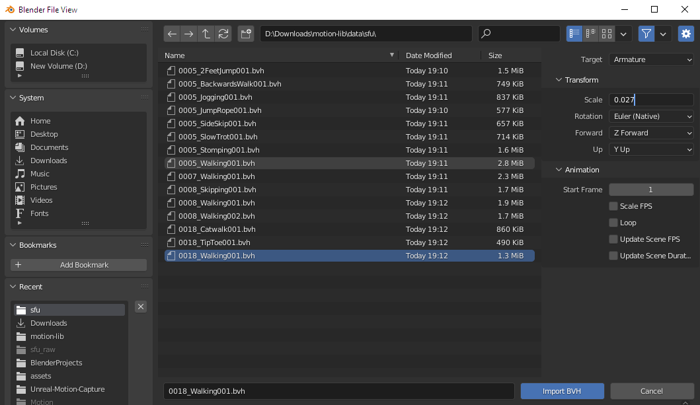

# Xilinx Vivado Install on Ubuntu 22.04

Download Vivado installer from [download page](https://www.xilinx.com/member/forms/download/xef.html?filename=Xilinx\_Unified\_2022.1\_0420\_0327\_Lin64.bin).

After download, run the following command to grant executable right to the binary file.

```
chmod +x Xilinx_Unified_2022.1_0420_0327_Lin64.bin
```

Then, run the file using&#x20;

```
sudo ./Xilinx_Unified_2022.1_0420_0327_Lin64.bin
```


<figure><figcaption></figcaption></figure>

<figure><figcaption></figcaption></figure>

<figure><figcaption></figcaption></figure>

Follow the commands in the installer. Installation directory is `~/Documents/Xilinx`

<figure><figcaption></figcaption></figure>


After installation, we need another dependency:

```
sudo apt install libtinfo5
```


Start vivado by running

```
/documents/Xilinx/Vivado/2022.1/bin/vivado
```


To connect to boards, we need to install additional drivers by running

```
cd ~/Documents/Xilinx/Vivado/2022.1/data/xicom/cable_drivers/lin64/install_script/install_drivers
sudo ./install_drivers
```

.png>)
