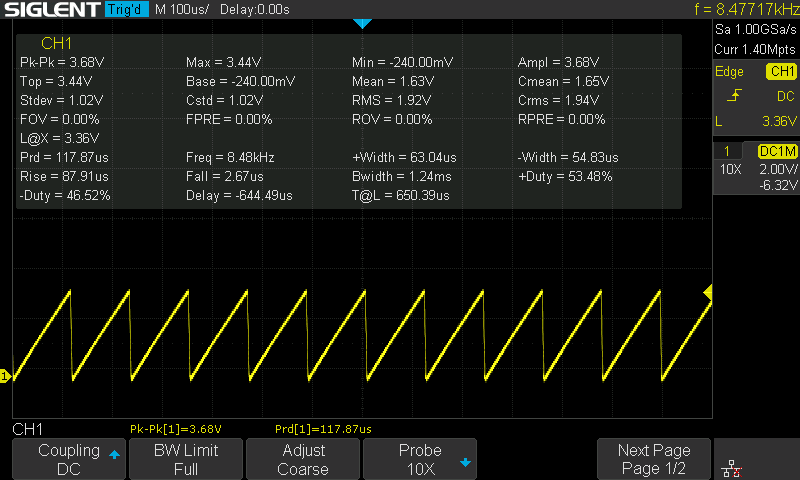

# Using DAC on STM32


### GPIO Configuration

The DAC module does not require much config. Enable the peripheral and configure the output to the desired pins.


### Start the DAC

```c
HAL_DAC_Start(&hdac, DAC_CHANNEL_1);
```


### Update DAC value

```c
HAL_DAC_SetValue(&hdac, DAC_CHANNEL_1, DAC_ALIGN_8B_R, 100);
```


### Example program

an example program to generate triangle wave on output.


```c
void APP_init() {
  HAL_DAC_Start(&hdac, DAC_CHANNEL_1);

  uint8_t value = 0;
  while (1) {
    HAL_DAC_SetValue(&hdac, DAC_CHANNEL_1, DAC_ALIGN_8B_R, value);
    value += 1;
  }
}
```


<figure><figcaption></figcaption></figure>


