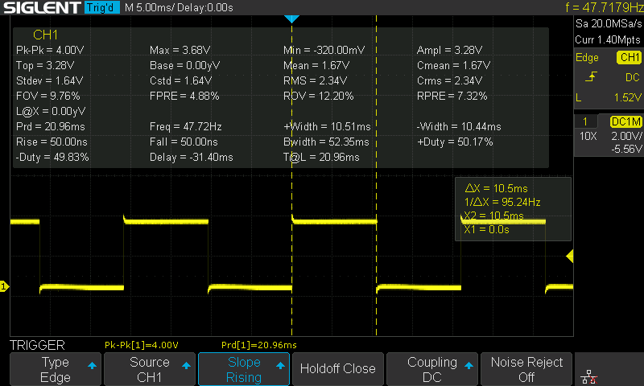
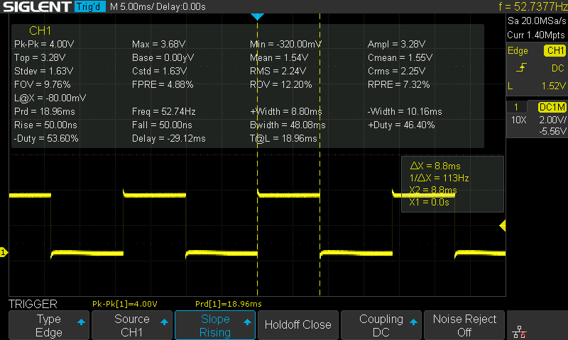
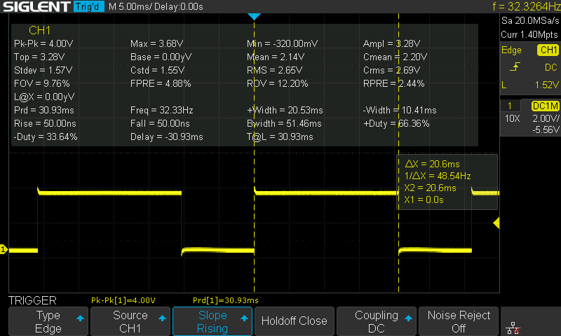
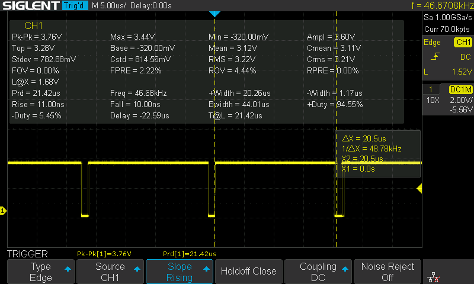
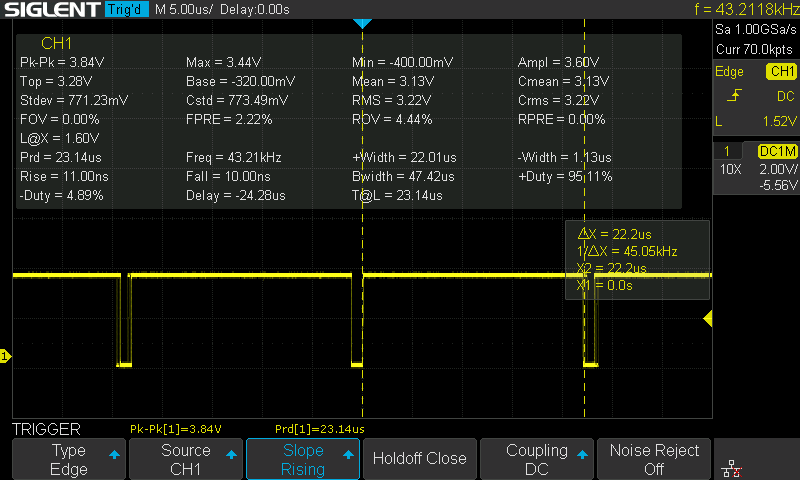
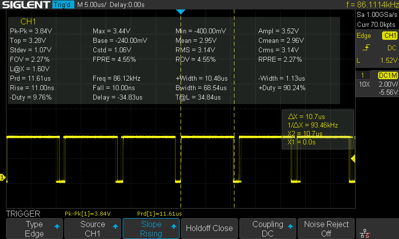

# Some Performance Measurements


## Maximum & Minimum Math Operation

All the operation is repeated 10000 times with random values

```c
void APP_main() {
  HAL_GPIO_WritePin(GPIOC, GPIO_PIN_14, 1);

  for (uint16_t i=0; i<10000; i+=1) {
    volatile float a = (float)rand();
    volatile float b = (float)rand();

    volatile float c = fmax(a, b);  // or fmaxf(); or fast_fmaxf()
  }

  HAL_GPIO_WritePin(GPIOC, GPIO_PIN_14, 0);

  HAL_Delay(10);
}

```


#### fast\_fmaxf implementation

```c
float fast_fmaxf(float a, float b) {
  return a > b ? a : b;
}

```


<figure><figcaption><p>fmaxf()</p></figcaption></figure>

<figure><figcaption><p>fast_fmaxf()</p></figcaption></figure>

<figure><figcaption><p>fmax()</p></figcaption></figure>


## SPI AS5047P Reading

SPI Speed: 1.25MBits/s and 10MBits/s

```c
/*
 * app.c
 *
 *  Created on: Dec 31, 2022
 *      Author: TK
 */

#include "app.h"

#define USE_INTERRUPT 1

extern SPI_HandleTypeDef hspi1;

extern UART_HandleTypeDef huart2;

uint8_t spi_received;

uint16_t getParity(uint16_t data) {
  data ^= data >> 8;              // example for 8-bit (this line scales it up to 16 bit)
  data ^= data >> 4;              // ( a b c d e f g h ) xor ( 0 0 0 0 a b c d ) = ( a b c d ae bf cg dh )
  data ^= data >> 2;              // ( a b c d ae bf cg dh ) xor ( 0 0 a b c d ae bf ) = ( a b ac bd ace bdf aceg bdfh )
  data ^= data >> 1;              // ( a b ac bd ace bdf aceg bdfh ) xor ( 0 a b ac bd ace bdf aceg ) = ( a ab abc abcd abcde abcdef abcdefg abcdefgh )
  return data & 1;                // if lsb of data is 0 -> data is even. if lsb of data is 1 -> data is odd.
}

void HAL_SPI_TxRxCpltCallback(SPI_HandleTypeDef *hspi) {
  HAL_GPIO_WritePin(GPIOA, GPIO_PIN_15, 1);
  spi_received = 1;
}

void APP_init() {
  spi_received = 0;
}

void APP_main() {
  uint16_t tx_buffer;
  uint16_t rx_buffer;

  tx_buffer = 0x3FFF;
  tx_buffer |= 1 << 14;
  tx_buffer |= getParity(tx_buffer) << 15;

  spi_received = 0;
  HAL_GPIO_WritePin(GPIOC, GPIO_PIN_14, 1);  // Limit SW L

  HAL_GPIO_WritePin(GPIOA, GPIO_PIN_15, 0);

  #if !USE_INTERRUPT
    HAL_SPI_TransmitReceive(&hspi1, (uint8_t *)&tx_buffer, (uint8_t *)&rx_buffer, 1, 100);
    HAL_GPIO_WritePin(GPIOA, GPIO_PIN_15, 1);
  #else
    HAL_SPI_TransmitReceive_IT(&hspi1, (uint8_t *)&tx_buffer, (uint8_t *)&rx_buffer, 1);
    while (!spi_received) {}
  #endif
  HAL_GPIO_WritePin(GPIOC, GPIO_PIN_14, 0);  // Limit SW L
}

```


<figure><figcaption><p>PC14, Blocking Mode @ 1.25MBits/s</p></figcaption></figure>

<figure><figcaption><p>PC14, Interrupt Mode @ 1.25MBits/s</p></figcaption></figure>

<figure><figcaption><p>PC14, Blocking Mode @ 10MBits/s</p></figcaption></figure>

<figure><figcaption><p>PC14, Interrupt Mode @ 10MBits/s</p></figcaption></figure>

There's an overhead of 1.7 us \~ 2.1 us when using interrupt mode compared to blocking mode.

