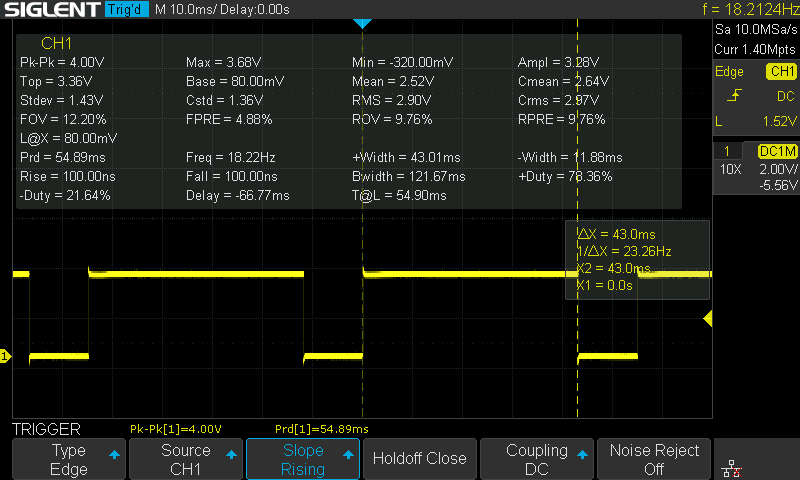
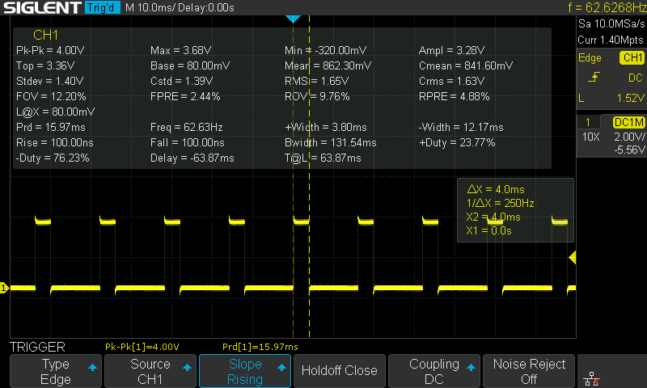

# Some Performance Measurements


## Maximum & Minimum Math Operation

All the operation is repeated 10000 times with random values

```c
void APP_main() {
  HAL_GPIO_WritePin(GPIOC, GPIO_PIN_14, 1);

  for (uint16_t i=0; i<10000; i+=1) {
    volatile float a = (float)rand();
    volatile float b = (float)rand();

    volatile float c = fmax(a, b);  // or fmaxf(); or fast_fmaxf()
  }

  HAL_GPIO_WritePin(GPIOC, GPIO_PIN_14, 0);

  HAL_Delay(10);
}

```

#### fast\_fmaxf implementation

```c
float fast_fmaxf(float a, float b) {
  return a > b ? a : b;
}

```


<figure><figcaption><p>fmaxf()</p></figcaption></figure>

<figure><figcaption><p>fast_fmaxf()</p></figcaption></figure>

<figure><figcaption><p>fmax()</p></figcaption></figure>


## Trigonometry Math Operation

All the operation is repeated 1000 times with increasing values from 0 to 999

```c
void APP_init() {
  CORDIC_ConfigTypeDef cordic_config;
  cordic_config.Function = CORDIC_FUNCTION_COSINE;  // ouput : cosine, then sine
  cordic_config.Scale = CORDIC_SCALE_0;             // not used
  cordic_config.InSize = CORDIC_INSIZE_32BITS;      // q31
  cordic_config.OutSize = CORDIC_OUTSIZE_32BITS;    // q31
  cordic_config.NbWrite = CORDIC_NBWRITE_1;         // ARG2 is 1 default
  cordic_config.NbRead = CORDIC_NBREAD_2;           // read cosine and sine
  cordic_config.Precision = CORDIC_PRECISION_4CYCLES; // better than 10-3

  HAL_CORDIC_Configure(&hcordic, &cordic_config);
}

void APP_main() {
  HAL_GPIO_WritePin(GPIOC, GPIO_PIN_14, 1);

  float result = 0;

  for (uint16_t i=0; i<1000; i+=1) {
    volatile float a = 0.001 * i;

    // math lib
    volatile float cos_a = cosf(a);
    volatile float sin_a = sinf(a);

    // LUT
//    volatile float cos_a = cosf_lut(a);
//    volatile float sin_a = sinf_lut(a);

    // CORDIC
//    int32_t cordic_arg[1];
//    int32_t cordic_res[2];
//    cordic_arg[0] = FLOAT_TO_Q31(wrapToPi(a)/M_PI);
//    HAL_CORDIC_Calculate(&hcordic, cordic_arg, cordic_res, 1, 100);
//    volatile float cos_a = Q31_TO_FLOAT(cordic_res[0]);
//    volatile float sin_a = Q31_TO_FLOAT(cordic_res[1]);

    result += sin_a;
  }

  HAL_GPIO_WritePin(GPIOC, GPIO_PIN_14, 0);

  char str[64];
  sprintf(str, "result: %f\r\n", result);
  HAL_UART_Transmit(&huart3, (uint8_t *)str, strlen(str), 1000);

  HAL_Delay(10);
}

```


Interesting observation:

when using sinf() and cosf() from the standard math library to perform the calculation, the processing speed varies greatly depending on the magnitude of the numbers.

<figure><figcaption><p>sinf(202.)</p></figcaption></figure>

<figure><figcaption><p>sinf(201.)</p></figcaption></figure>

When the absolute value of the operand is greater than 201, the processing speed decreases by 10x.


#### Trig LUT

```c
#define LUT_MULT  81.4873308631f

const float sin_tab[] = {
    0,0.012296,0.024589,0.036879,0.049164,0.061441,0.073708,0.085965,0.098208,0.11044,0.12265,0.13484,0.14702,0.15917,0.17129,0.18339,0.19547,0.20751,0.21952,0.2315,0.24345,0.25535,0.26722,0.27905,0.29084,0.30258,0.31427,0.32592,0.33752,0.34907,0.36057,0.37201,0.38339,0.39472,0.40599,0.41719,0.42834,0.43941,0.45043,0.46137,0.47224,0.48305,0.49378,0.50443,0.51501,0.52551,0.53593,0.54627,0.55653,0.5667,0.57679,0.58679,0.5967,0.60652,0.61625,0.62589,0.63543,0.64488,0.65423,0.66348,0.67263,0.68167,0.69062,0.69946,0.70819,0.71682,0.72534,0.73375,0.74205,0.75023,0.75831,0.76626,0.77411,0.78183,0.78944,0.79693,0.80429,0.81154,0.81866,0.82566,0.83254,0.83928,0.84591,0.8524,0.85876,0.865,0.8711,0.87708,0.88292,0.88862,0.89419,0.89963,0.90493,0.9101,0.91512,0.92001,0.92476,0.92937,0.93384,0.93816,0.94235,0.94639,0.95029,0.95405,0.95766,0.96113,0.96445,0.96763,0.97066,0.97354,0.97628,0.97887,0.98131,0.9836,0.98574,0.98774,0.98958,0.99128,0.99282,0.99422,0.99546,0.99656,0.9975,0.99829,0.99894,0.99943,0.99977,0.99996,1,0.99988,0.99962,0.9992,0.99863,0.99792,0.99705,0.99603,0.99486,0.99354,0.99207,0.99045,0.98868,0.98676,0.98469,0.98247,0.9801,0.97759,0.97493,0.97212,0.96916,0.96606,0.96281,0.95941,0.95587,0.95219,0.94836,0.94439,0.94028,0.93602,0.93162,0.92708,0.9224,0.91758,0.91263,0.90753,0.9023,0.89693,0.89142,0.88579,0.88001,0.87411,0.86807,0.8619,0.8556,0.84917,0.84261,0.83593,0.82911,0.82218,0.81512,0.80793,0.80062,0.7932,0.78565,0.77798,0.7702,0.7623,0.75428,0.74615,0.73791,0.72956,0.72109,0.71252,0.70384,0.69505,0.68616,0.67716,0.66806,0.65886,0.64956,0.64017,0.63067,0.62108,0.6114,0.60162,0.59176,0.5818,0.57176,0.56163,0.55141,0.54111,0.53073,0.52027,0.50973,0.49911,0.48842,0.47765,0.46682,0.45591,0.44493,0.43388,0.42277,0.4116,0.40036,0.38906,0.37771,0.36629,0.35483,0.3433,0.33173,0.32011,0.30843,0.29671,0.28495,0.27314,0.26129,0.2494,0.23748,0.22552,0.21352,0.20149,0.18943,0.17735,0.16523,0.15309,0.14093,0.12875,0.11655,0.10432,0.092088,0.079838,0.067576,0.055303,0.043022,0.030735,0.018443,0.0061479,-0.0061479,-0.018443,-0.030735,-0.043022,-0.055303,-0.067576,-0.079838,-0.092088,-0.10432,-0.11655,-0.12875,-0.14093,-0.15309,-0.16523,-0.17735,-0.18943,-0.20149,-0.21352,-0.22552,-0.23748,-0.2494,-0.26129,-0.27314,-0.28495,-0.29671,-0.30843,-0.32011,-0.33173,-0.3433,-0.35483,-0.36629,-0.37771,-0.38906,-0.40036,-0.4116,-0.42277,-0.43388,-0.44493,-0.45591,-0.46682,-0.47765,-0.48842,-0.49911,-0.50973,-0.52027,-0.53073,-0.54111,-0.55141,-0.56163,-0.57176,-0.5818,-0.59176,-0.60162,-0.6114,-0.62108,-0.63067,-0.64017,-0.64956,-0.65886,-0.66806,-0.67716,-0.68616,-0.69505,-0.70384,-0.71252,-0.72109,-0.72956,-0.73791,-0.74615,-0.75428,-0.7623,-0.7702,-0.77798,-0.78565,-0.7932,-0.80062,-0.80793,-0.81512,-0.82218,-0.82911,-0.83593,-0.84261,-0.84917,-0.8556,-0.8619,-0.86807,-0.87411,-0.88001,-0.88579,-0.89142,-0.89693,-0.9023,-0.90753,-0.91263,-0.91758,-0.9224,-0.92708,-0.93162,-0.93602,-0.94028,-0.94439,-0.94836,-0.95219,-0.95587,-0.95941,-0.96281,-0.96606,-0.96916,-0.97212,-0.97493,-0.97759,-0.9801,-0.98247,-0.98469,-0.98676,-0.98868,-0.99045,-0.99207,-0.99354,-0.99486,-0.99603,-0.99705,-0.99792,-0.99863,-0.9992,-0.99962,-0.99988,-1,-0.99996,-0.99977,-0.99943,-0.99894,-0.99829,-0.9975,-0.99656,-0.99546,-0.99422,-0.99282,-0.99128,-0.98958,-0.98774,-0.98574,-0.9836,-0.98131,-0.97887,-0.97628,-0.97354,-0.97066,-0.96763,-0.96445,-0.96113,-0.95766,-0.95405,-0.95029,-0.94639,-0.94235,-0.93816,-0.93384,-0.92937,-0.92476,-0.92001,-0.91512,-0.9101,-0.90493,-0.89963,-0.89419,-0.88862,-0.88292,-0.87708,-0.8711,-0.865,-0.85876,-0.8524,-0.84591,-0.83928,-0.83254,-0.82566,-0.81866,-0.81154,-0.80429,-0.79693,-0.78944,-0.78183,-0.77411,-0.76626,-0.75831,-0.75023,-0.74205,-0.73375,-0.72534,-0.71682,-0.70819,-0.69946,-0.69062,-0.68167,-0.67263,-0.66348,-0.65423,-0.64488,-0.63543,-0.62589,-0.61625,-0.60652,-0.5967,-0.58679,-0.57679,-0.5667,-0.55653,-0.54627,-0.53593,-0.52551,-0.51501,-0.50443,-0.49378,-0.48305,-0.47224,-0.46137,-0.45043,-0.43941,-0.42834,-0.41719,-0.40599,-0.39472,-0.38339,-0.37201,-0.36057,-0.34907,-0.33752,-0.32592,-0.31427,-0.30258,-0.29084,-0.27905,-0.26722,-0.25535,-0.24345,-0.2315,-0.21952,-0.20751,-0.19547,-0.18339,-0.17129,-0.15917,-0.14702,-0.13484,-0.12265,-0.11044,-0.098208,-0.085965,-0.073708,-0.061441,-0.049164,-0.036879,-0.024589,-0.012296,0
};

float sinf_lut(float theta){
  theta = fmodf(theta, 2*M_PI);
  theta = theta<0 ? theta + 2*M_PI : theta;

  return sin_tab[(int) (LUT_MULT*theta)];
}

float cosf_lut(float theta){
  return sinf_lut(M_PI / 2 - theta);
}

```

#### CORDIC

```c
#define Q31_TO_FLOAT(x) ((float)(x) / (float)(0x80000000))
#define FLOAT_TO_Q31(x) ((int32_t)((float)(x) * (float)0x7FFFFFFF))

float wrapToPi(float value) {
  return fmodf(value + M_PI, 2*M_PI) - M_PI;
}
```


## SPI AS5047P Reading

SPI Speed: 1.25MBits/s and 10MBits/s

```c
/*
 * app.c
 *
 *  Created on: Dec 31, 2022
 *      Author: TK
 */

#include "app.h"

#define USE_INTERRUPT 1

extern SPI_HandleTypeDef hspi1;

extern UART_HandleTypeDef huart2;

uint8_t spi_received;

uint16_t getParity(uint16_t data) {
  data ^= data >> 8;              // example for 8-bit (this line scales it up to 16 bit)
  data ^= data >> 4;              // ( a b c d e f g h ) xor ( 0 0 0 0 a b c d ) = ( a b c d ae bf cg dh )
  data ^= data >> 2;              // ( a b c d ae bf cg dh ) xor ( 0 0 a b c d ae bf ) = ( a b ac bd ace bdf aceg bdfh )
  data ^= data >> 1;              // ( a b ac bd ace bdf aceg bdfh ) xor ( 0 a b ac bd ace bdf aceg ) = ( a ab abc abcd abcde abcdef abcdefg abcdefgh )
  return data & 1;                // if lsb of data is 0 -> data is even. if lsb of data is 1 -> data is odd.
}

void HAL_SPI_TxRxCpltCallback(SPI_HandleTypeDef *hspi) {
  HAL_GPIO_WritePin(GPIOA, GPIO_PIN_15, 1);
  spi_received = 1;
}

void APP_init() {
  spi_received = 0;
}

void APP_main() {
  uint16_t tx_buffer;
  uint16_t rx_buffer;

  tx_buffer = 0x3FFF;
  tx_buffer |= 1 << 14;
  tx_buffer |= getParity(tx_buffer) << 15;

  spi_received = 0;
  HAL_GPIO_WritePin(GPIOC, GPIO_PIN_14, 1);  // Limit SW L

  HAL_GPIO_WritePin(GPIOA, GPIO_PIN_15, 0);

  #if !USE_INTERRUPT
    HAL_SPI_TransmitReceive(&hspi1, (uint8_t *)&tx_buffer, (uint8_t *)&rx_buffer, 1, 100);
    HAL_GPIO_WritePin(GPIOA, GPIO_PIN_15, 1);
  #else
    HAL_SPI_TransmitReceive_IT(&hspi1, (uint8_t *)&tx_buffer, (uint8_t *)&rx_buffer, 1);
    while (!spi_received) {}
  #endif
  HAL_GPIO_WritePin(GPIOC, GPIO_PIN_14, 0);  // Limit SW L
}

```


<figure><figcaption><p>PC14, Blocking Mode @ 1.25MBits/s</p></figcaption></figure>

<figure><figcaption><p>PC14, Interrupt Mode @ 1.25MBits/s</p></figcaption></figure>

<figure><figcaption><p>PC14, Blocking Mode @ 10MBits/s</p></figcaption></figure>

<figure><figcaption><p>PC14, Interrupt Mode @ 10MBits/s</p></figcaption></figure>

There's an overhead of 1.7 us \~ 2.1 us when using interrupt mode compared to blocking mode.

