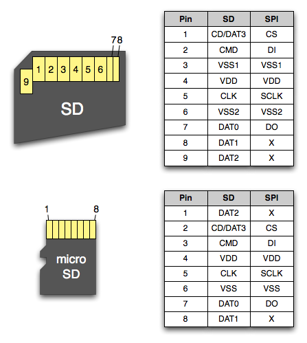
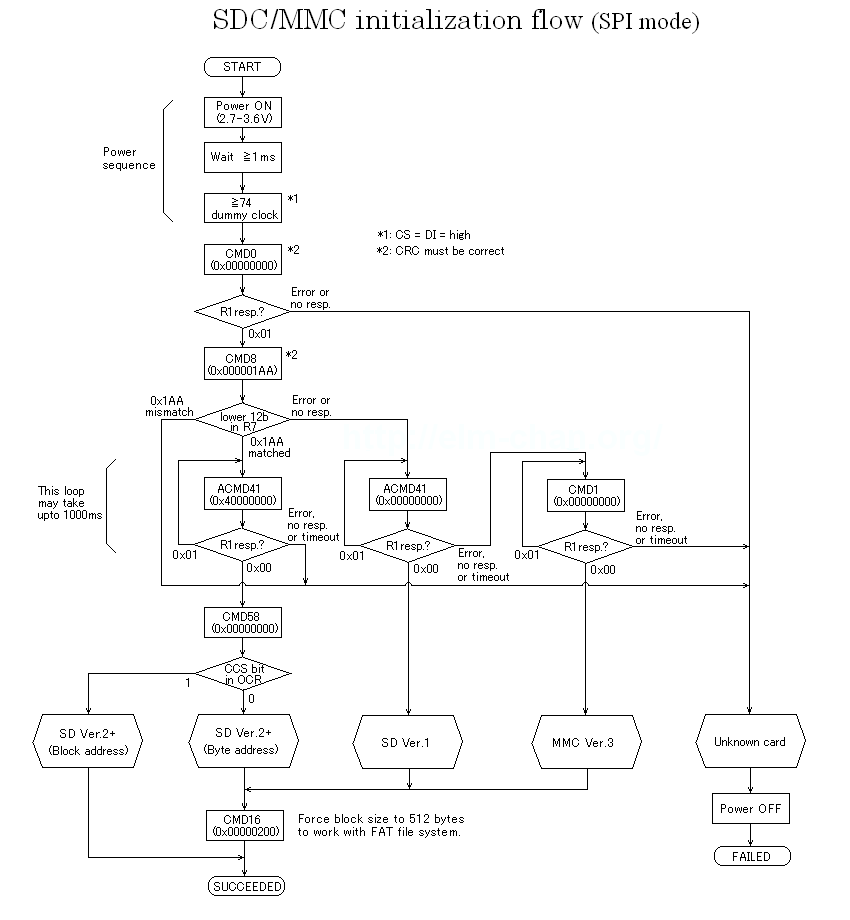

# SPI - SD Card

## 0. Principal of Operation

### Signals

SD card supports multiple protocols. We will use SPI here.

<figure><figcaption></figcaption></figure>

<figure><figcaption></figcaption></figure>

### Initialization

Before performing data read and write, we need to first initialize the SD card, in which we need to perform the following steps:

1. After the SD card is detected (using the card detect circuit, or on program start), we need to wait at least 1 ms after the VDD of the card is settled (6.4.1.1. Power Up Time of Card: "device shall be ready to accept the first command within 1ms from detecting VDD min."). To be safe, we are using a 2 ms delay.
2. Clock SCLK at least 74 cycles with CS pin pulled high. We can do this by sending 16 bytes of 0xFF to the SPI bus with CS manually pulled high. We will start with 400 kHz SCLK speed to be on the safe side. After this, we will operate CS normally according to SPI protocol.
3. Send CMD0 (go to idle state) `0x40 00 00 00 00 95` until we receive a valid response (which is `0x01`). If receive `0xFF`, we need to transceive more data (response comes up to 8 bytes later) or resend CMD0 until you get a response. For any other response starting with a 0 bit, see "7.3.2.1 Format R1".
4. Send CMD8 (interface condition), e.g. `0x48 00 00 01 AA 87` (see "4.3.13 Send Interface Condition Command (CMD8)"). The '1' in the argument states that we support 2.7-3.6 V, the 'AA' is a check pattern that we will receive again by the card and use to check if the connection and supply are good. The reply is described in "7.3.2.6 Format R7" and "4.9.6 R7 (Card interface condition)". If the card's response starts with `0x05` (illegal cmd) or `0x0D` (+CRC error), it is likely that we have an old V1.X SD Card (<= 2 GB) that doesn't support the command. Otherwise, the response should be `0x01 .. .. .1 AA` (. = 4 bits of don't care, 1 = voltage range 2.7-3.6 V, AA = our check pattern). If this worked (or the command is not supported), continue.
5. Send CMD55 (to signalize the next command is an application-specific command, so ACMDxx), i.e. `0x77 00 00 00 00 65`. Response should be `0x01` (or `0x00`).
6. Send ACMD41 (send operation condition). Set HCS to 1 (argument: `0x40000000`) to support SDHC/SDXC cards (otherwise you would only support standard capacity cards <= 2 GB): `0x69 40 00 00 00 77`. The response should be either `0x01` (which means we are still in "idle" state and need to repeat steps 6-7 (send CMD55+ACMD41) or `0x00`, which means that the SD card left the "idle" state and is ready to operate. Only continue with step 8 if you receive `0x00`.
7.  Send CMD58 again (read OCR) `7A 00 00 00 00 FD`. This time the "Card power up status bit" should be 1. If it is, the Card capacity status (CCS) (bit 30) is valid. If the CCS bit is 1, we have a SDHC (2-32 GB) or SDXC (32GB-2TB) card. If it is 0, we have an SDSC card (<= 2 GB).

<figure><figcaption></figcaption></figure>

### Read Sector

SD card performs read in unit of sectors. The default sector size is 512 bytes.

## 1. Configuration

Set SPI to MODE0, MSB, with a speed not greater than 400kHz.

<figure><figcaption></figcaption></figure>

.png>)

NOTE: the MISO pin needs to be configured to be pull-up on STM32 to be compatible with the SD card.&#x20;

In APP\_init(), we use the function `SDCARD_init(&card, &hspi1, GPIOB, GPIO_PIN_6)` to initialize the `SDCard card` struct with our SPI and GPIO settings.

In the `SDCARD_initializeCard(&card, 2000)` function, we execute the SD card initialization routine.&#x20;

## Reference

How can I initialize/use SD cards with SPI? Stack Exchange: [https://electronics.stackexchange.com/questions/602105/how-can-i-initialize-use-sd-cards-with-spi?newreg=55068098904d49ce9062c5ca84870ab3](https://electronics.stackexchange.com/questions/602105/how-can-i-initialize-use-sd-cards-with-spi?newreg=55068098904d49ce9062c5ca84870ab3)

How to Use MMC/SDC. 0xAA55: [http://elm-chan.org/docs/mmc/mmc\_e.html](http://elm-chan.org/docs/mmc/mmc\_e.html)

Lecture 12: SPI and SD cards. EE-379 Embedded Systems and Applications, University at Buffalo: [http://www.dejazzer.com/ee379/lecture\_notes/lec12\_sd\_card.pdf](http://www.dejazzer.com/ee379/lecture\_notes/lec12\_sd\_card.pdf)

SD v2 Initialization. Rob's personal collection: [http://bikealive.nl/sd-v2-initialization.html](http://bikealive.nl/sd-v2-initialization.html)

[https://github.com/hazelnusse/crc7](https://github.com/hazelnusse/crc7)

[https://github.com/erley/stm32-sdcard/blob/master/sdcard/sys/BSP/stm32\_sd\_spi.c](https://github.com/erley/stm32-sdcard/blob/master/sdcard/sys/BSP/stm32\_sd\_spi.c)

