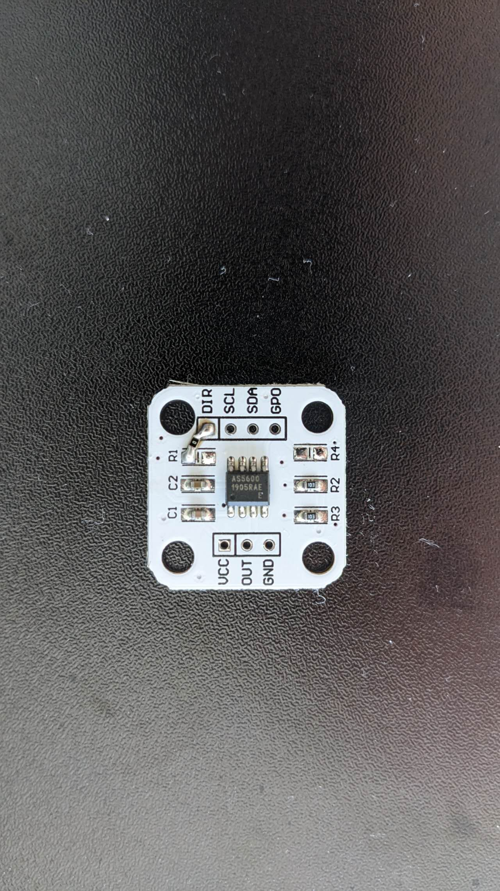

# AS5600 Modification

<figure><figcaption></figcaption></figure>

If want to use 5V on VCC port:

remove R1

If want to restore PGO to normal operation:

remove R4

If want to use CCW rotation:

tie DIR to VDD&#x20;

can use the 0R jumper to tie DIR pad to top of R1, which is connected to VCC (near the "R1" text side)

After modification:

<figure><figcaption></figcaption></figure>
