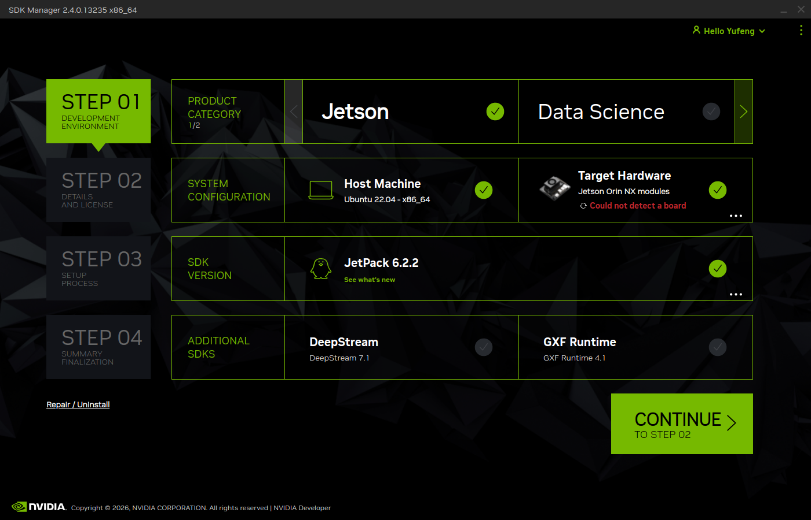
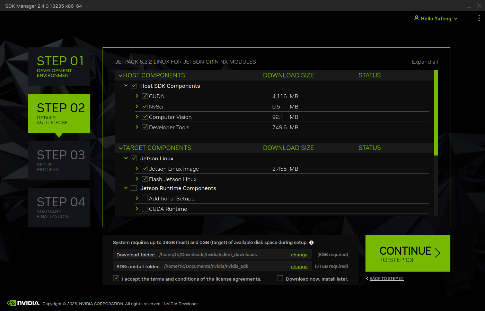
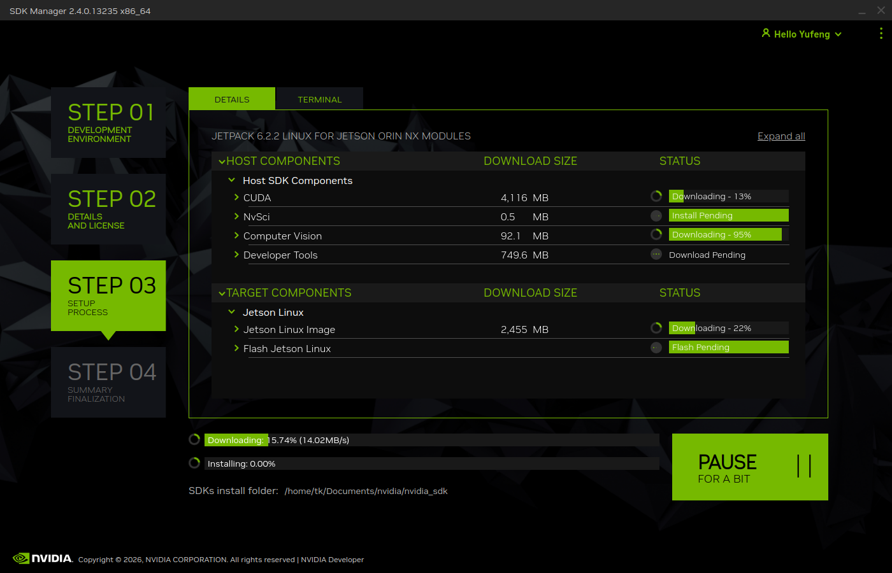
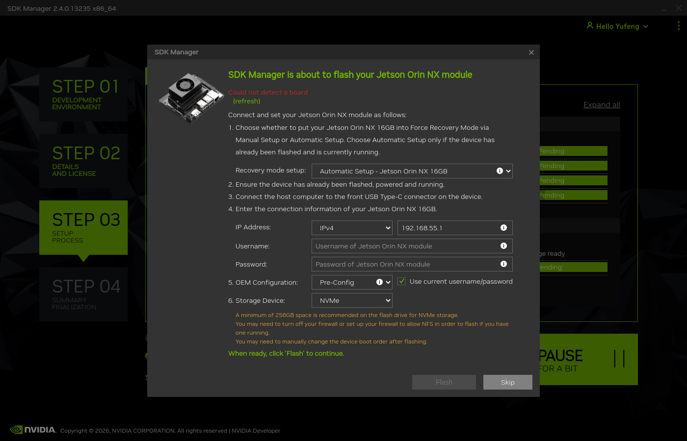
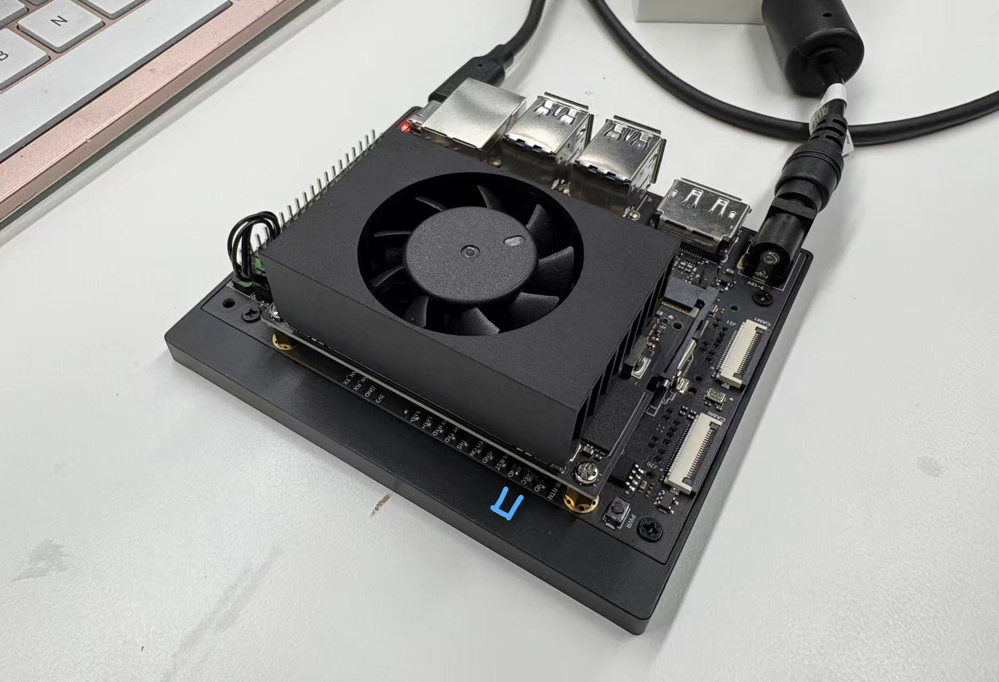

# Getting Started with Jetson Using SDK Manager on Ubuntu 22.04

This tutorial will cover how to install Ubuntu 22.04 on NVIDIA Jetson AGX Orin and Jetson Orin NX series with the NVIDIA SDK Manager.



## **2026-02-16 Update**

It seems that in the JetPack 6.2.2 release, the shell script has some typo error. At the time of the writing this is not resolved yet. We will introduce the workaround solution down below.



## Requirements

* NVIDIA Jetson AGX Orin Development Kit or NVIDIA Jetson Orin NX Development Kit and its accessories (power supply).
* DisplayPort cable and a compatible monitor.
* USB Type A keyboard and mouse
* A Linux host computer with Ubuntu 22.04 installed.


NVIDIA SDK Manager has strict requirement on the host OS version. The system compatibility matrix is available from the [SDK Manager website](https://developer.nvidia.com/sdk-manager):

<figure><figcaption></figcaption></figure>


Additionally, install these packages on the host system:

```bash
sudo apt-get install make build-essential libncurses-dev bison flex libssl-dev libelf-dev
```


## Install NVIDIA SDK Manager

Download SDK Manager from [this website](https://developer.nvidia.com/sdk-manager).


After download, use apt package manager to install the application.

```bash
sudo apt install ~/Downloads/sdkmanager_2.4.0-13235_amd64.deb
```


Launch SDKManager from the app search page.

<figure><figcaption></figcaption></figure>


## Download SDK Components

For this step, we don't need to connect the hardware yet.

Launch SDK Manager.

In Step 01, select the target hardware and the JetPack version.

<figure><figcaption></figcaption></figure>


In Step 02, select to install "Host SDK Components" and "Jetson Linux".

Here, we set download path as

```bash
/home/tk/Downloads/nvidia/sdkm_downloads/
```

and the installation path as

```bash
/home/tk/Documents/nvidia/nvidia_sdk/
```

<figure><figcaption></figcaption></figure>


Wait for download and install.

<figure><figcaption></figcaption></figure>


Towards the end of installation, it will try to connect to the board. We can simply skip this step.

<figure><figcaption></figcaption></figure>


## Toolchain Setup

Since we are going to modify the Linux Kernel, we also need to download the compilation toolchain.

Download [Bootlin Toolchain gcc 11.3](https://developer.nvidia.com/downloads/embedded/l4t/r36_release_v3.0/toolchain/aarch64--glibc--stable-2022.08-1.tar.bz2) from the release page:



<figure><figcaption></figcaption></figure>


After download, unpack the file to the following directory:

```bash
/home/tk/Documents/nvidia/toolchain/aarch64--glibc--stable-2022.08-1/
```


## Configure the Kernel


This is where we need to apply the typo fix.


Sync the kernel source code with Git


```bash
cd /home/tk/Documents/nvidia/nvidia_sdk/JetPack_6.2.2_Linux_JETSON_ORIN_NX_TARGETS/Linux_for_Tegra/source/
./source_sync.sh -k
```


A bunch of file will appear under `<install_path>/Linux_for_Tegra/source/` .


To enable realtime kernel, run


```bash
cd ~/Documents/nvidia/nvidia_sdk/JetPack_6.2.2_Linux_JETSON_ORIN_NX_TARGETS/Linux_for_Tegra/source/
./generic_rt_build.sh "enable"
```



By default, the gs\_usb module is not included on JetPack 6.X. This makes the USB-CAN adapter unusable.

To add USB-CAN support, edit the config file and add the following fields:

```bash
nano ./kernel/kernel-jammy-src/arch/arm64/configs/defconfig
```


```diff
CONFIG_CAN=m
+ CONFIG_CAN_GS_USB=m
CONFIG_CAN_VCAN=m
CONFIG_CAN_FLEXCAN=m
CONFIG_CAN_RCAR=m
CONFIG_CAN_RCAR_CANFD=m
```



```diff
CONFIG_USB_SERIAL=m
CONFIG_USB_SERIAL_CP210X=m
+ CONFIG_USB_SERIAL_CH341=m
CONFIG_USB_SERIAL_FTDI_SIO=m
CONFIG_USB_SERIAL_OPTION=m
```



## Building the Kernel

Now, we can proceed to build the kernel and out-of-tree modules.

#### Build Kernel


```bash
cd /home/tk/Documents/nvidia/nvidia_sdk/JetPack_6.2.2_Linux_JETSON_ORIN_NX_TARGETS/Linux_for_Tegra/source/
export CROSS_COMPILE=/home/tk/Documents/nvidia/toolchain/aarch64--glibc--stable-2022.08-1/bin/aarch64-buildroot-linux-gnu-
make -C kernel
```



```bash
export INSTALL_MOD_PATH=/home/tk/Documents/nvidia/nvidia_sdk/JetPack_6.2.2_Linux_JETSON_ORIN_NX_TARGETS/Linux_for_Tegra/rootfs/
sudo -E make install -C ./kernel/
cp ./kernel/kernel-jammy-src/arch/arm64/boot/Image /home/tk/Documents/nvidia/nvidia_sdk/JetPack_6.2.2_Linux_JETSON_ORIN_NX_TARGETS/Linux_for_Tegra/kernel/Image
```


#### Build OOT Modules


```bash
cd /home/tk/Documents/nvidia/nvidia_sdk/JetPack_6.2.2_Linux_JETSON_ORIN_NX_TARGETS/Linux_for_Tegra/source/
export IGNORE_PREEMPT_RT_PRESENCE=1
export CROSS_COMPILE=/home/tk/Documents/nvidia/toolchain/aarch64--glibc--stable-2022.08-1/bin/aarch64-buildroot-linux-gnu-
export KERNEL_HEADERS=$PWD/kernel/kernel-jammy-src/
make modules
```



```bash
export INSTALL_MOD_PATH=/home/tk/Documents/nvidia/nvidia_sdk/JetPack_6.2.2_Linux_JETSON_ORIN_NX_TARGETS/Linux_for_Tegra/rootfs/
sudo -E make modules_install
```



```bash
cd /home/tk/Documents/nvidia/nvidia_sdk/JetPack_6.2.2_Linux_JETSON_ORIN_NX_TARGETS/Linux_for_Tegra/
sudo ./tools/l4t_update_initrd.sh
```



#### (Optionally) Build DTB


```bash
cd /home/tk/Documents/nvidia/nvidia_sdk/JetPack_6.2.2_Linux_JETSON_ORIN_NX_TARGETS/Linux_for_Tegra/source/
export CROSS_COMPILE=/home/tk/Documents/nvidia/toolchain/aarch64--glibc--stable-2022.08-1/bin/aarch64-buildroot-linux-gnu-
export KERNEL_HEADERS=$PWD/kernel/kernel-jammy-src/
make dtbs
cp ./kernel-devicetree/generic-dts/dtbs/* /home/tk/Documents/nvidia/nvidia_sdk/JetPack_6.2.2_Linux_JETSON_ORIN_NX_TARGETS/Linux_for_Tegra/kernel/dtb/
```



## Hardware Connection



<figure><figcaption></figcaption></figure>

Connect USB keyboard and mouse, and the DisplayPort port to a monitor.

Connect to the host computer with the provided USB Type-C to Type A cable **using the port near the 40 pin header**.

Lastly, while **holding the recovery button** (middle button), connect the USB Type-C power cable. The device will enter recover mode and can be detected on the USB port.



<figure><figcaption></figcaption></figure>

Set a jumper header between the GND and the FC REC pin on the pin header underneath the main Jetson board.

Then, plug in power and USB cable.




After connecting the hardware and powering up the device, it should automatically detect the USB device connection.

Select the correct device type.


Choose the desired component to install. Here we select everything.

We assume the download directory is set to  `~/Downloads/nvidia/sdkm_downloads/`, and the final SDK installation directory at `~/Documents/nvidia/nvidia_sdk/`.

(image is not showing the correct paths).

<figure><figcaption></figcaption></figure>


After entering the system password, it will begin to download and install the components.

<figure><figcaption></figcaption></figure>

After it's done, it will prompt to configure the account information and ask for the installation location.

We will install to the built-in eMMC device.

<figure><figcaption></figcaption></figure>


About one third into the installation process, the Jetson will reboot and boot into the system.

When this happens, the SDKManager on the host computer will create this prompt.

Wait until the Jetson boots up fully, then log into the system, and then click Install on the host side.

<figure><figcaption></figcaption></figure>

If it cannot find the device through the USB connection, try Ethernet connection instead.



## Note

Sometimes it will report this error:


```sh
ERROR Flash Jetson Linux - flash: exportfs: Failed to stat /home/tk/Documents/nvidia/nvidia_sdk/JetPack_6.2_Linux_JETSON_ORIN_NX_TARGETS/: No such file or directory
```


In case this happens, a possible solutions is as follows.

```bash
sudo nano /etc/exports
```

Remove ALL the uncommented lines in the file.

\
\
Then, try the installation again.



The rest of the installation takes about one hour to finish.

<figure><figcaption></figcaption></figure>


Finally, to verify the installed version, run the following commands on Jetson

```bash
sudo apt show nvidia-jetpack -a
```


### Verify USB-CAN Connection


## References










#### Useful links for USB-CAN

[https://forums.developer.nvidia.com/t/does-jetpack-6-0-not-support-gs-usb-usb-to-can/328702](https://forums.developer.nvidia.com/t/does-jetpack-6-0-not-support-gs-usb-usb-to-can/328702)

[https://forums.developer.nvidia.com/t/missing-gs-usb-kernel-module-for-jetpack-6/275287/7](https://forums.developer.nvidia.com/t/missing-gs-usb-kernel-module-for-jetpack-6/275287/7)

[https://forums.developer.nvidia.com/t/flashing-orion-nx-on-seed-recomputer-j4012-success/290669](https://forums.developer.nvidia.com/t/flashing-orion-nx-on-seed-recomputer-j4012-success/290669)

#### Useful links for CH340/CH341 Driver

[https://forums.developer.nvidia.com/t/issue-with-ch340-usb-to-serial-converter-not-creating-device-files-on-jetson-orin-nano-super/326022](https://forums.developer.nvidia.com/t/issue-with-ch340-usb-to-serial-converter-not-creating-device-files-on-jetson-orin-nano-super/326022)

[https://nvidia-jetson.piveral.com/jetson-orin-nano/orin-nano-wont-detect-arduino-dev-ttyusb-or-dev-ttyacm/](https://nvidia-jetson.piveral.com/jetson-orin-nano/orin-nano-wont-detect-arduino-dev-ttyusb-or-dev-ttyacm/)


### Starting over

To remove all the existing configurations of the SDK Manager, run the following command

```bash
rm -rf ~/.nvsdkm/
```


