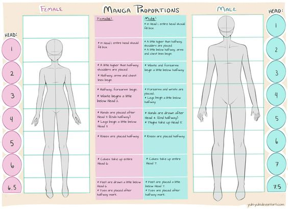

# Robot Body Ratio Issue

尽管已经在 VRoid 里面调整过了，但真实的 Human Body Scale 和 Anime 的仍有些差距

<figure><figcaption>
RealWorld Scale
</figcaption></figure>

<figure><figcaption></figcaption></figure>

可以看到主要的差别在腿长和肩宽上，但 Real Human Body 的 scale 又有些呆了，所以打算微调一下，希望这样不会影响控制效果

<figure><figcaption>
Adjusted Scale
</figcaption></figure>

比例[参考图](https://www.deviantart.com/yubi-yubi/art/Female-and-Male-Manga-Proportion-Guide-459511163).

<figure><figcaption></figcaption></figure>

<figure><figcaption></figcaption></figure>
